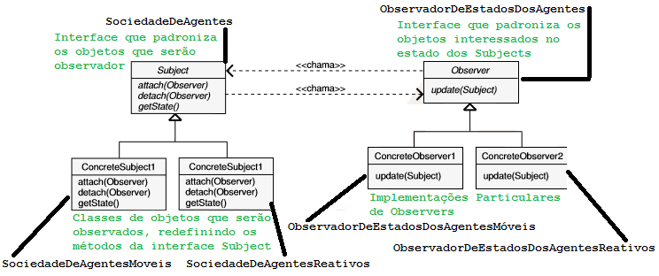
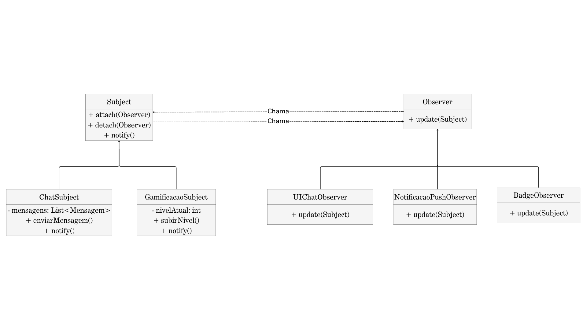

# Padrão de Projeto: Observer

## Introdução

O Observer é um padrão de projeto comportamental. Ele define uma relação de dependência "um-para-muitos" entre objetos, de forma que, quando um objeto (o "Subject" ou "Observado") muda seu estado, todos os seus dependentes (os "Observers" ou "Observadores") são notificados e atualizados automaticamente.

Este padrão promove um baixo acoplamento entre o Sujeito e seus Observadores. O Sujeito não precisa saber nada sobre as classes concretas dos seus observadores; ele apenas se comunica com eles através de uma interface comum (`Observer`). [[1](#ref1),[2](#ref2)].

No contexto do CorreioDigital, o padrão Observer será aplicado de forma genérica e reutilizável. Módulos como Chat (notificação de nova mensagem) e Gamificação (desbloqueio de conquistas e níveis) atuarão como Subjects, enquanto elementos da interface do usuário (UI), feed social, e sistema de notificações serão Observers que reagem automaticamente a mudanças de estado.
Dessa forma, o sistema permanece desacoplado, extensível e preparado para futuras integrações, como push notifications e sinalização em tempo real para web/mobile.

## Objetivo/Metodologia

O objetivo deste documento é apresentar e justificar a aplicação do padrão de projeto Observer no CorreioDigital, evidenciando como esse padrão permite a notificação automática e desacoplada entre componentes do sistema. A implementação será utilizada de forma genérica e reutilizável em diferentes contextos, como notificações em tempo real no chat, atualização visual do perfil do usuário e sistema de gamificação, garantindo extensibilidade, baixo acoplamento e escalabilidade da arquitetura.

A elaboração deste artefato foi conduzida com base na abordagem proposta pela Gang of Four (GoF) para padrões comportamentais, incluindo:

- Análise de cenários reativos do CorreioDigital, identificando eventos que devem disparar notificações automáticas (ex.: nova mensagem, desbloqueio de conquista, mudança de status do usuário).
- Mapeamento dos papéis do padrão Observer no contexto do projeto, definindo Subjects (produtores de eventos) e Observers (componentes interessados nas mudanças).
- Modelagem UML, feita no Canva, para visualizar as relações entre os componentes e padronizar a estrutura de comunicação.
- Elaboração de exemplo prático, demonstrando com clareza a aplicação do padrão em uma situação real do sistema.
- Validação arquitetural, garantindo que a solução proposta seja reutilizável e expansível para múltiplos módulos futuros (como feed social e push notifications).

## Observer no CorreioDigital

No CorreioDigital, o Observer foi pensado como um mecanismo genérico para tratar eventos que precisam ser propagados automaticamente para diferentes partes do sistema — sem acoplamento direto entre os componentes. Isso permite que novas reações sejam adicionadas futuramente sem alterar a lógica principal.

A estrutura central funciona com dois papéis bem definidos:

- `Subject` → é quem gera o evento (ex.: nova mensagem, novo nível, nova conquista);

- `Observer` → é quem reage quando esse evento acontece (ex.: interface do usuário, sistema de notificações, feed público, badges visuais).

### Exemplo de uso no CorreioDigital

Hoje, o Observer será aplicado inicialmente em dois fluxos principais do sistema:

- Chat → quando um usuário envia uma nova mensagem, o ChatSubject dispara uma notificação automática para seus observadores. Isso pode atualizar a interface em tempo real ou disparar um push para o outro usuário.

- Gamificação → quando o usuário completa uma missão ou sobe de nível, o GamificacaoSubject notifica observadores como BadgeObserver (que exibe medalhas no perfil) ou FeedObserver (que publica no feed social).

### Reutilização e escalabilidade

A vantagem é que essa estrutura é totalmente reutilizável, podendo facilmente adicionar novos observers no futuro, como:

- Notificação por e-mail ou push
- Registro de auditoria/admin
- Atualização de ranking público ou placar semanal

Sem alterar o código dos módulos principais (chat ou gamificação), preservando a arquitetura limpa e desacoplada.

[[1](#ref1)]

## Diagramas UML

### Diagrama Genérico do Padrão

Este, na figura 1, é o diagrama conceitual do padrão Observer, mostrando a relação entre as interfaces e as classes concretas.

<div align="center">
    Figura 1: Diagrama genérico do padrão Observer
    <br>
    
    <br>
    <b>Fonte:</b> <a href="https://aprender3.unb.br/pluginfile.php/3178398/mod_page/content/1/Material%20Complementar%20T%C3%B3pico%202%20-%20DSW%20-%20GoFs%20Comportamentais.zip">Aprender 3 - Arquitetura de Software</a> 
    <br> 
</div>

### Diagrama Específico do "Correio Digital"

O diagrama, presente na figura abaixo, representa o diagrama específico do Observer no contexto do nosso projeto.

<div align="center">
    Figura 2: Diagrama do padrão Observer no Correio Digital
    <br>
    
    <br>
    <b>Autora: </b><a href="https://github.com/Maryyscreuza">Mariiana Siqueira</a>. 
    <br> 
    <br> 
</div>

Onde consta, 

#### INTERFACE CENTRAL
- Subject
- Observer

#### CONCRETE SUBJECTS
- ChatSubject → implementa Subject 
- GamificacaoSubject → implementa Subject

#### CONCRETE OBSERVERS
- UIChatObserver → escuta ChatSubject → atualiza tela de chat em tempo real
- NotificacaoPushObserver → escuta Chat e Gamificação → dispara push web/app
- BadgeObserver → escuta GamificacaoSubject → destrava medalha

[[1](#ref1),[2](#ref2)]

-----

## Adaptações em relação ao modelo original da professora apresentado em aula

Durante a aplicação do padrão **Observer** ao contexto do projeto **Correio Digital**, algumas adaptações foram necessárias para adequar o modelo de referência disponibilizado pela professora à realidade do sistema.

| Elemento Original | Adaptação para o Correio Digital | Justificativa |
| :--- | :--- | :--- |
| `Subject` | Mantido como interface principal (`Subject`) | Mantém a estrutura base do padrão e o princípio de desacoplamento. |
| `ConcreteSubject1`, `ConcreteSubject2` | Substituídos pelas classes `ChatSubject` e `GamificacaoSubject` | No Correio Digital, há dois eventos observáveis diferentes. |
| `Observer` | Mantido como interface (`Observer`) | Essencial para garantir a flexibilidade e extensibilidade dos canais de notificação. |
| `ConcreteObserver1`, `ConcreteObserver2` | Adaptados para `UIChatObserver`, `NotificacaoPushObserver` e `BadgeObserver` | Representam os diferentes canais reais de notificação do sistema. |
| Parâmetro `update(subject)` | Mantido | Mantém a estrutura base do padrão. |

[[1](#ref1)]

-----

## Implementação em Python

A seguir, apresentamos o código-fonte completo em Python, seguindo o modelo de Orientação a Objetos e as definições do diagrama.

### Interface Subject e Observer

```python
from abc import ABC, abstractmethod

class Observer(ABC):
    @abstractmethod
    def update(self, subject) -> None:
        pass

class Subject(ABC):
    def __init__(self):
        self._observers = []

    def attach(self, observer: Observer) -> None:
        self._observers.append(observer)

    def detach(self, observer: Observer) -> None:
        self._observers.remove(observer)

    def notify(self) -> None:
        for observer in self._observers:
            observer.update(self)
```

### Subjects Concretos 

```python
class ChatSubject(Subject):
    def __init__(self):
        super().__init__()
        self.mensagem = None

    def enviar_mensagem(self, texto, usuario):
        self.mensagem = f"{usuario}: {texto}"
        print(f"[Chat] Nova mensagem enviada: {self.mensagem}")
        self.notify()

class GamificacaoSubject(Subject):
    def __init__(self):
        super().__init__()
        self.level = 1

    def subir_nivel(self):
        self.level += 1
        print(f"[Gamificação] Usuário subiu para o nível {self.level}")
        self.notify()
```

### Observers

```python
class UIChatObserver(Observer):
    def update(self, subject) -> None:
        print(f"[UI] Atualizando chat com mensagem: {subject.mensagem}")

class BadgeObserver(Observer):
    def update(self, subject) -> None:
        print(f"[Gamificação UI] Nova conquista desbloqueada! Nível: {subject.level}")
```

### Execução de Exemplo

```python
if __name__ == "__main__":
    chat = ChatSubject()
    gamificacao = GamificacaoSubject()

    ui_chat = UIChatObserver()
    badge = BadgeObserver()

    chat.attach(ui_chat)
    gamificacao.attach(badge)

    chat.enviar_mensagem("Olá, tudo bem?", "Maria")
    gamificacao.subir_nivel()
```

## Testes Unitários

Para garantir que a implementação funciona corretamente, desenvolvemos uma suíte completa de testes unitários utilizando a biblioteca `unittest` do Python. Os testes foram organizados em diferentes classes, cada uma focada em validar um aspecto específico do sistema:

### Estratégia de Teste

Como os observadores concretos (`UIChatObserver` e `BadgeObserver`) dependem de saídas no console através de `print()`, utilizamos o módulo `unittest.mock` para capturar a saída padrão (`stdout`) com o decorator `@patch('sys.stdout', new_callable=StringIO)`. Isso permite verificar se as mensagens corretas foram impressas sem poluir o console durante a execução dos testes.

Além disso, empregamos **mocks** (objetos simulados) para isolar os componentes durante os testes unitários. Isso garante que cada teste valide apenas a funcionalidade específica da classe em questão, sem depender do comportamento de outras classes, respeitando o princípio de isolamento dos testes unitários.

### Cobertura dos Testes

A suíte de testes abrange:

- **Testes da classe base `Subject`**: Validam o gerenciamento de observers (anexar, remover e notificar)
- **Testes dos subjects concretos** (`ChatSubject` e `GamificacaoSubject`): Verificam a lógica de negócio específica e o disparo correto de notificações
- **Testes dos observers concretos**: Garantem que as atualizações são processadas e exibidas corretamente
- **Testes de integração**: Validam o fluxo completo do padrão Observer, desde o evento no subject até a resposta dos observers

#### Código de teste

<details>
  <summary><strong> Teste do observer </strong></summary>

O código abaixo contém o arquivo de teste completo dos arquivos do observer.

```python
import unittest
from unittest.mock import Mock, patch, call
from io import StringIO

from abc import ABC, abstractmethod

class Observer(ABC):
    @abstractmethod
    def update(self, subject) -> None:
        pass

class Subject(ABC):
    def __init__(self):
        self._observers = []

    def attach(self, observer: Observer) -> None:
        self._observers.append(observer)

    def detach(self, observer: Observer) -> None:
        self._observers.remove(observer)

    def notify(self) -> None:
        for observer in self._observers:
            observer.update(self)

class ChatSubject(Subject):
    def __init__(self):
        super().__init__()
        self.mensagem = None

    def enviar_mensagem(self, texto, usuario):
        self.mensagem = f"{usuario}: {texto}"
        print(f"[Chat] Nova mensagem enviada: {self.mensagem}")
        self.notify()

class GamificacaoSubject(Subject):
    def __init__(self):
        super().__init__()
        self.level = 1

    def subir_nivel(self):
        self.level += 1
        print(f"[Gamificação] Usuário subiu para o nível {self.level}")
        self.notify()

class UIChatObserver(Observer):
    def update(self, subject) -> None:
        print(f"[UI] Atualizando chat com mensagem: {subject.mensagem}")

class BadgeObserver(Observer):
    def update(self, subject) -> None:
        print(f"[Gamificação UI] Nova conquista desbloqueada! Nível: {subject.level}")


# ========TESTES UNITÁRIOS========

class TestSubject(unittest.TestCase):
    # Testes para a classe abstrata Subject
    
    def setUp(self):
        # Configuração antes de cada teste
        # Criar uma implementação concreta de Subject para testes
        class ConcreteSubject(Subject):
            pass
        self.subject = ConcreteSubject()
    
    def test_inicializacao(self):
        # Testa se a lista de observers é inicializada vazia 
        self.assertEqual(len(self.subject._observers), 0)
        self.assertIsInstance(self.subject._observers, list)
    
    def test_attach_observer(self):
        # Testa se um observer é anexado corretamente 
        observer = Mock(spec=Observer)
        self.subject.attach(observer)
        self.assertIn(observer, self.subject._observers)
        self.assertEqual(len(self.subject._observers), 1)
    
    def test_attach_multiplos_observers(self):
        # Testa se múltiplos observers são anexados 
        observer1 = Mock(spec=Observer)
        observer2 = Mock(spec=Observer)
        observer3 = Mock(spec=Observer)
        
        self.subject.attach(observer1)
        self.subject.attach(observer2)
        self.subject.attach(observer3)
        
        self.assertEqual(len(self.subject._observers), 3)
        self.assertIn(observer1, self.subject._observers)
        self.assertIn(observer2, self.subject._observers)
        self.assertIn(observer3, self.subject._observers)
    
    def test_detach_observer(self):
        # Testa se um observer é removido corretamente 
        observer = Mock(spec=Observer)
        self.subject.attach(observer)
        self.subject.detach(observer)
        self.assertNotIn(observer, self.subject._observers)
        self.assertEqual(len(self.subject._observers), 0)
    
    def test_detach_observer_especifico(self):
        # Testa se apenas o observer correto é removido 
        observer1 = Mock(spec=Observer)
        observer2 = Mock(spec=Observer)
        
        self.subject.attach(observer1)
        self.subject.attach(observer2)
        self.subject.detach(observer1)
        
        self.assertNotIn(observer1, self.subject._observers)
        self.assertIn(observer2, self.subject._observers)
        self.assertEqual(len(self.subject._observers), 1)
    
    def test_notify_chama_update_em_todos_observers(self):
        # Testa se notify chama update em todos os observers 
        observer1 = Mock(spec=Observer)
        observer2 = Mock(spec=Observer)
        
        self.subject.attach(observer1)
        self.subject.attach(observer2)
        self.subject.notify()
        
        observer1.update.assert_called_once_with(self.subject)
        observer2.update.assert_called_once_with(self.subject)
    
    def test_notify_sem_observers(self):
        # Testa se notify funciona mesmo sem observers anexados 
        # Não deve lançar exceção
        try:
            self.subject.notify()
        except Exception as e:
            self.fail(f"notify() lançou exceção inesperada: {e}")


class TestChatSubject(unittest.TestCase):
    # Testes para a classe ChatSubject 
    
    def setUp(self):
        # Configuração antes de cada teste 
        self.chat = ChatSubject()
    
    def test_inicializacao(self):
        # Testa se o chat é inicializado corretamente 
        self.assertIsNone(self.chat.mensagem)
        self.assertEqual(len(self.chat._observers), 0)
    
    def test_herda_de_subject(self):
        # Testa se ChatSubject herda de Subject 
        self.assertIsInstance(self.chat, Subject)
    
    @patch('sys.stdout', new_callable=StringIO)
    def test_enviar_mensagem_atualiza_mensagem(self, mock_stdout):
        # Testa se enviar_mensagem atualiza o atributo mensagem 
        self.chat.enviar_mensagem("Olá", "João")
        self.assertEqual(self.chat.mensagem, "João: Olá")
    
    @patch('sys.stdout', new_callable=StringIO)
    def test_enviar_mensagem_formata_corretamente(self, mock_stdout):
        # Testa se a mensagem é formatada corretamente 
        usuario = "Maria"
        texto = "Como vai?"
        self.chat.enviar_mensagem(texto, usuario)
        self.assertEqual(self.chat.mensagem, f"{usuario}: {texto}")
    
    @patch('sys.stdout', new_callable=StringIO)
    def test_enviar_mensagem_imprime_no_console(self, mock_stdout):
        # Testa se a mensagem é impressa no console 
        self.chat.enviar_mensagem("Teste", "Pedro")
        output = mock_stdout.getvalue()
        self.assertIn("[Chat] Nova mensagem enviada:", output)
        self.assertIn("Pedro: Teste", output)
    
    @patch('sys.stdout', new_callable=StringIO)
    def test_enviar_mensagem_notifica_observers(self, mock_stdout):
        # Testa se enviar_mensagem notifica os observers 
        observer = Mock(spec=Observer)
        self.chat.attach(observer)
        self.chat.enviar_mensagem("Oi", "Ana")
        observer.update.assert_called_once_with(self.chat)
    
    @patch('sys.stdout', new_callable=StringIO)
    def test_multiplas_mensagens(self, mock_stdout):
        # Testa o envio de múltiplas mensagens
        observer = Mock(spec=Observer)
        self.chat.attach(observer)
        
        self.chat.enviar_mensagem("Primeira", "User1")
        self.chat.enviar_mensagem("Segunda", "User2")
        
        self.assertEqual(self.chat.mensagem, "User2: Segunda")
        self.assertEqual(observer.update.call_count, 2)


class TestGamificacaoSubject(unittest.TestCase):
    # Testes para a classe GamificacaoSubject
    
    def setUp(self):
        # Configuração antes de cada teste
        self.gamificacao = GamificacaoSubject()
    
    def test_inicializacao(self):
        # Testa se a gamificação inicia no nível 1
        self.assertEqual(self.gamificacao.level, 1)
        self.assertEqual(len(self.gamificacao._observers), 0)
    
    def test_herda_de_subject(self):
        # Testa se GamificacaoSubject herda de Subject
        self.assertIsInstance(self.gamificacao, Subject)
    
    @patch('sys.stdout', new_callable=StringIO)
    def test_subir_nivel_incrementa_level(self, mock_stdout):
        # Testa se subir_nivel incrementa o level
        nivel_inicial = self.gamificacao.level
        self.gamificacao.subir_nivel()
        self.assertEqual(self.gamificacao.level, nivel_inicial + 1)
    
    @patch('sys.stdout', new_callable=StringIO)
    def test_subir_multiplos_niveis(self, mock_stdout):
        # Testa múltiplas subidas de nível
        self.gamificacao.subir_nivel()
        self.gamificacao.subir_nivel()
        self.gamificacao.subir_nivel()
        self.assertEqual(self.gamificacao.level, 4)
    
    @patch('sys.stdout', new_callable=StringIO)
    def test_subir_nivel_imprime_no_console(self, mock_stdout):
        # Testa se a subida de nível é impressa no console
        self.gamificacao.subir_nivel()
        output = mock_stdout.getvalue()
        self.assertIn("[Gamificação] Usuário subiu para o nível", output)
        self.assertIn("2", output)
    
    @patch('sys.stdout', new_callable=StringIO)
    def test_subir_nivel_notifica_observers(self, mock_stdout):
        # Testa se subir_nivel notifica os observers
        observer = Mock(spec=Observer)
        self.gamificacao.attach(observer)
        self.gamificacao.subir_nivel()
        observer.update.assert_called_once_with(self.gamificacao)
    
    @patch('sys.stdout', new_callable=StringIO)
    def test_subir_nivel_notifica_com_level_correto(self, mock_stdout):
        # Testa se os observers recebem o level correto
        observer = Mock(spec=Observer)
        self.gamificacao.attach(observer)
        self.gamificacao.subir_nivel()
        self.gamificacao.subir_nivel()
        
        # Verificar que foi chamado 2 vezes
        self.assertEqual(observer.update.call_count, 2)
        # Verificar que o level no momento da última chamada é 3
        self.assertEqual(self.gamificacao.level, 3)


class TestUIChatObserver(unittest.TestCase):
    # Testes para a classe UIChatObserver
    
    def setUp(self):
        # Configuração antes de cada teste
        self.observer = UIChatObserver()
    
    def test_herda_de_observer(self):
        # Testa se UIChatObserver herda de Observer
        self.assertIsInstance(self.observer, Observer)
    
    @patch('sys.stdout', new_callable=StringIO)
    def test_update_imprime_mensagem(self, mock_stdout):
        # Testa se update imprime a mensagem corretamente
        chat = ChatSubject()
        chat.mensagem = "Teste: Mensagem de teste"
        
        self.observer.update(chat)
        output = mock_stdout.getvalue()
        
        self.assertIn("[UI] Atualizando chat com mensagem:", output)
        self.assertIn("Teste: Mensagem de teste", output)
    
    @patch('sys.stdout', new_callable=StringIO)
    def test_update_com_mensagem_none(self, mock_stdout):
        # Testa update quando a mensagem é None
        chat = ChatSubject()
        # mensagem permanece None
        
        self.observer.update(chat)
        output = mock_stdout.getvalue()
        
        self.assertIn("[UI] Atualizando chat com mensagem:", output)
        self.assertIn("None", output)


class TestBadgeObserver(unittest.TestCase):
    # Testes para a classe BadgeObserver
    
    def setUp(self):
        # Configuração antes de cada teste
        self.observer = BadgeObserver()
    
    def test_herda_de_observer(self):
        # Testa se BadgeObserver herda de Observer
        self.assertIsInstance(self.observer, Observer)
    
    @patch('sys.stdout', new_callable=StringIO)
    def test_update_imprime_nivel(self, mock_stdout):
        # Testa se update imprime o nível corretamente
        gamificacao = GamificacaoSubject()
        gamificacao.level = 5
        
        self.observer.update(gamificacao)
        output = mock_stdout.getvalue()
        
        self.assertIn("[Gamificação UI] Nova conquista desbloqueada!", output)
        self.assertIn("Nível: 5", output)
    
    @patch('sys.stdout', new_callable=StringIO)
    def test_update_com_diferentes_niveis(self, mock_stdout):
        # Testa update com diferentes níveis
        gamificacao = GamificacaoSubject()
        
        for nivel in [1, 10, 50, 100]:
            gamificacao.level = nivel
            self.observer.update(gamificacao)
        
        output = mock_stdout.getvalue()
        self.assertIn("Nível: 1", output)
        self.assertIn("Nível: 10", output)
        self.assertIn("Nível: 50", output)
        self.assertIn("Nível: 100", output)


class TestIntegracaoObserverPattern(unittest.TestCase):
    # Testes de integração do padrão Observer
    
    @patch('sys.stdout', new_callable=StringIO)
    def test_chat_com_observer_integrado(self, mock_stdout):
        # Testa o fluxo completo: chat -> notificação -> observer
        chat = ChatSubject()
        ui_observer = UIChatObserver()
        
        chat.attach(ui_observer)
        chat.enviar_mensagem("Olá, mundo!", "Usuário")
        
        output = mock_stdout.getvalue()
        self.assertIn("[Chat] Nova mensagem enviada:", output)
        self.assertIn("[UI] Atualizando chat com mensagem:", output)
        self.assertIn("Usuário: Olá, mundo!", output)
    
    @patch('sys.stdout', new_callable=StringIO)
    def test_gamificacao_com_observer_integrado(self, mock_stdout):
        # Testa o fluxo completo: gamificação -> notificação -> observer
        gamificacao = GamificacaoSubject()
        badge_observer = BadgeObserver()
        
        gamificacao.attach(badge_observer)
        gamificacao.subir_nivel()
        
        output = mock_stdout.getvalue()
        self.assertIn("[Gamificação] Usuário subiu para o nível 2", output)
        self.assertIn("[Gamificação UI] Nova conquista desbloqueada!", output)
        self.assertIn("Nível: 2", output)
    
    @patch('sys.stdout', new_callable=StringIO)
    def test_multiplos_observers_no_mesmo_subject(self, mock_stdout):
        # Testa múltiplos observers recebendo notificações
        chat = ChatSubject()
        observer1 = UIChatObserver()
        observer2 = UIChatObserver()
        
        chat.attach(observer1)
        chat.attach(observer2)
        chat.enviar_mensagem("Teste", "Admin")
        
        output = mock_stdout.getvalue()
        # Deve aparecer 2 vezes (um para cada observer)
        self.assertEqual(output.count("[UI] Atualizando chat com mensagem:"), 2)
    
    @patch('sys.stdout', new_callable=StringIO)
    def test_remocao_de_observer(self, mock_stdout):
        # Testa se observer removido não recebe notificações
        chat = ChatSubject()
        observer = UIChatObserver()
        
        chat.attach(observer)
        chat.enviar_mensagem("Primeira", "User")
        
        chat.detach(observer)
        mock_stdout.truncate(0)
        mock_stdout.seek(0)
        
        chat.enviar_mensagem("Segunda", "User")
        output = mock_stdout.getvalue()
        
        # Deve aparecer apenas a mensagem do chat, não do observer
        self.assertIn("[Chat] Nova mensagem enviada:", output)
        self.assertNotIn("[UI] Atualizando chat com mensagem:", output)


if __name__ == '__main__':
    # Executar todos os testes com verbosidade
    unittest.main(verbosity=2)
```

</details> 

[[3](#ref3),[4](#ref4)]

## Análise de Vantagens e Desvantagens

A aplicação do padrão Observer no "Correio Digital" traz benefícios claros, mas também impõe algumas considerações.

### Vantagens

| Vantagem | Descrição |
| :--- | :--- |
| **Baixo Acoplamento (Desacoplamento)** | Subjects (ChatSubject, GamificacaoSubject) interagem apenas com a interface `Observer`, sem conhecer as classes concretas. Permite adicionar, remover ou modificar *observers* sem alterar o código dos *subjects*. |
| **Adesão ao Princípio Aberto-Fechado (OCP)** | O sistema está **aberto para extensão** (fácil adição de novos *observers* como LogObserver, EmailObserver) e **fechado para modificação** (não é necessário alterar *subjects* existentes). |
| **Coesão e Responsabilidade Única** | A lógica de notificação é encapsulada em classes coesas. Cada *subject* foca em seu gerenciamento (mensagens, níveis) e cada *observer* tem uma responsabilidade específica (atualizar UI, enviar notificação, gerenciar conquistas). |
| **Flexibilidade em Tempo de Execução** | As relações entre *subjects* e *observers* (anexar/remover) podem ser estabelecidas e desfeitas dinamicamente durante a execução, ajustando o comportamento do sistema sem reinicialização. |
| **Reutilização de Observers** | Um mesmo *observer* (ex: NotificacaoPushObserver) pode monitorar múltiplos *subjects* (ChatSubject e GamificacaoSubject), evitando duplicação de código. |

### Desvantagens

| Desvantagem | Descrição |
| :--- | :--- |
| **Ordem de Notificação Imprevisível** | O padrão puro não garante a ordem em que os *observers* serão notificados. Depender da ordem de inserção (*append*) é uma má prática. Se a sequência for crítica (ex: UI antes de Push), é necessária uma camada adicional de controle ou priorização. |
| **Notificações Inesperadas (Efeito Cascata)** | Se um *observer*, ao ser notificado, causar uma mudança em outro objeto que também é um *subject*, pode iniciar uma complexa e difícil de rastrear cascata de notificações, potencialmente criando *loops* infinitos. |
| **Overhead de Performance** | Em sistemas com grande volume de notificações ou muitos *observers* registrados, o processo de iteração e notificação de todos pode se tornar um gargalo de desempenho. |
| **Gerenciamento de "Observadores Mortos" (*Memory Leaks*)** | Se um *observer* for destruído sem ser explicitamente desanexado (`detach`) do *subject*, o *subject* mantém uma referência a ele. Isso impede a liberação de memória (*garbage collection*), resultando em um *memory leak*. É crucial garantir a chamada de `detach()` no ciclo de vida do *observer*. |

[[3](#ref3),[4](#ref4)]


## Bibliografia

  1. <a id="ref1"></a>Material da disciplina: Aula GoFs Comportamentais (Prof. Milene) — PDF e vídeo.
  2. <a id="ref2"></a>REFACTORING GURU. Observer Pattern. Refactoring Guru, [s.d.]. Disponível em: https://refactoring.guru/design-patterns/observer. Acesso em: 2 jun. 2025.
  3. <a id="ref3"></a>Sourcemaking: [https://sourcemaking.com/design\_patterns/observer/java/1](https://sourcemaking.com/design_patterns/observer/java/1)
  4. <a id="ref4"></a>Tutorialspoint: [https://www.tutorialspoint.com/design\_pattern/observer\_pattern.htm](https://www.tutorialspoint.com/design_pattern/observer_pattern.htm)
  5. <a id="ref5"></a>GAMMA, E.; HELM, R.; JOHNSON, R.; VLISSIDES, J. Design Patterns: Elements of Reusable Object-Oriented Software. Reading, MA: Addison-Wesley, 1995.

----
## Histórico de Versões

| Versão | Data | Descrição | Autor(es) | Revisor(es) | Detalhes da revisão |
| :--- | :--- | :--- | :--- | :--- | :--- |
| `1.0` | 17/10/2025 | Criação do documento baseado em UML criado por nós, exemplo Python e testes; | [Esther Sena](https://github.com/esmsena) | - | - |
| `1.1` | 21/10/2025 | Adição da complementar da estrutura com códigos feito a partir de nossa estrutura UML, juntamente com uma analise superio comparando com exemplo dado em sala de aula, e também adicionando uma explicação melhor do documento juntamente com sua estrutura | [Esther Sena ](https://github.com/esmsena) | - | - |
| `1.2` | 21/10/2025 | Atualização da introdução com os pontos focais do CorreioDigital, atualização estrutural do documento, adição da imagem do diagrama genérico e inserção do diagrama do nosso projeto. | [Mariiana Neris](https://github.com/Maryyscreuza) | - | - |