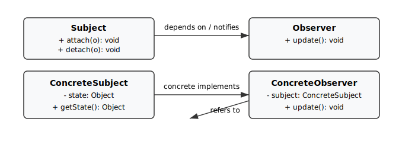

# Padrão Observer (Observador)

## Introdução

O padrão Observer é um padrão comportamental que estabelece uma relação um-para-muitos entre objetos, permitindo que um sujeito (Subject) notifique automaticamente todos os observadores (Observers) quando seu estado muda. Ele é útil para implementar mecanismos de eventos, notificações ou qualquer situação em que várias partes do sistema precisem reagir a mudanças de estado.

No contexto deste repositório, o exemplo prático foi implementado em Python para facilitar execução e testes automáticos.

## Objetivo/Metodologia

O objetivo desta documentação é apresentar o padrão Observer, demonstrar uma implementação de referência e oferecer instruções para executar e testar o exemplo. A metodologia adotada para produzir o artefato incluiu:

- Análise do padrão e documentação de participantes (Subject, Observer, ConcreteSubject, ConcreteObserver).
- Implementação de um exemplo minimalista em Python (NewsAgency e NewsReader) para demonstrar o fluxo de notificação.
- Escrita de testes automatizados com `pytest` para garantir comportamento correto.
- Substituição do exemplo Java original por este exemplo Python a pedido do time; foi criado histórico (commit) que contém a remoção dos arquivos Java.

## Implementação (exemplo Python)

Trecho representativo (trecho reduzido) do exemplo em `observer-example-py`:

```python
# observer/news_agency.py (excerto)
class NewsAgency(Subject):
	def __init__(self) -> None:
		self._observers: List[Observer] = []
		self._news: str | None = None

	def attach(self, observer: Observer) -> None:
		self._observers.append(observer)

	def notify(self) -> None:
		for o in list(self._observers):
			o.update()

	def set_news(self, news: str) -> None:
		self._news = news
		self.notify()
```

E um observador simples:

```python
# observer/news_reader.py (excerto)
class NewsReader(Observer):
	def __init__(self, agency: NewsAgency, name: str) -> None:
		self._agency = agency
		self._name = name
		self._agency.attach(self)

	def update(self) -> None:
		print(f"[{self._name}] Nova notícia: {self._agency.get_news()}")
```

## Como executar

```bash
cd docs/PadroesDeProjeto/GoFsComportamentais/observer-example-py
python3 -m venv .venv
source .venv/bin/activate
pip install -r requirements.txt
python main.py
```

### Executar testes

```bash
pytest -q
```

## Diagrama UML

O diagrama simplificado do padrão está disponível em `observer_uml.svg` (ao lado deste documento):



## Vantagens

- Baixo acoplamento entre sujeito e observadores.
- Flexibilidade para adicionar/remover observadores em tempo de execução.
- Facilita implementação de eventos e assinaturas.

## Desvantagens

- Possível excesso de notificações e impacto de performance quando houver muitos observadores.
- Ordem de notificação não garantida explicitamente; pode afetar comportamento.
- Pode dificultar rastreamento de dependências em sistemas grandes.

## Bibliografia

- Material da disciplina: Aula GoFs Comportamentais (Prof. Milene) — PDF e vídeo.
- Sourcemaking: https://sourcemaking.com/design_patterns/observer/java/1
- Tutorialspoint: https://www.tutorialspoint.com/design_pattern/observer_pattern.htm

## Histórico de Versões

| Versão |     Data    | Descrição   | Autor(es) | Revisor(es) | Detalhes da revisão |
| ------ | ----------- | ----------- | --------- | ----------- | --------------------|
| `1.0`  | 17/10/2025  | Criação do documento, exemplo Python e testes; | Esther Sena | - | - |


