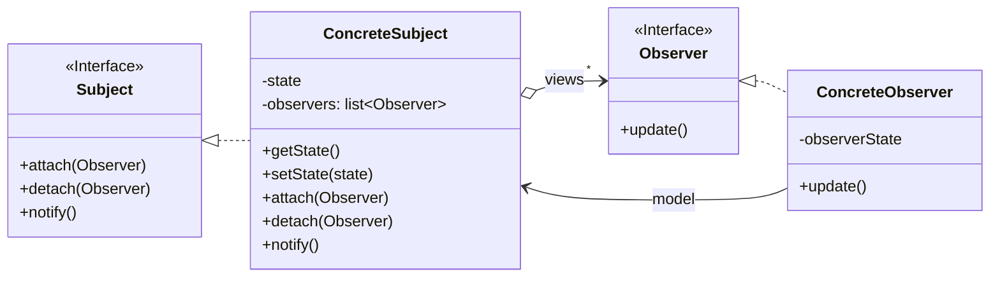
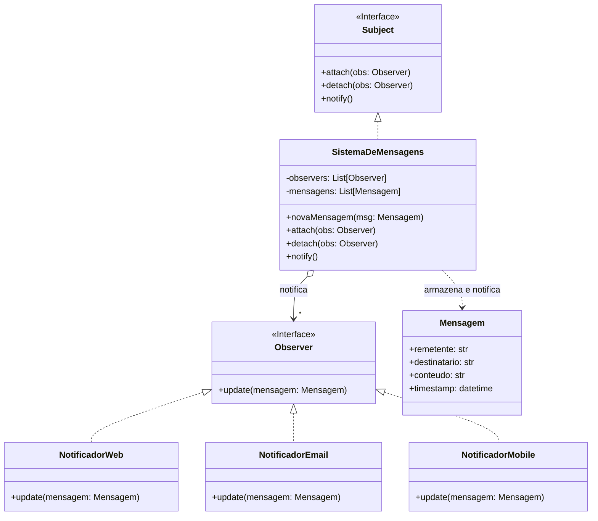

# Padrão de Projeto: Observer


## 1\. Introdução

O Observer é um padrão de projeto comportamental. Ele define uma relação de dependência "um-para-muitos" entre objetos, de forma que, quando um objeto (o "Subject" ou "Observado") muda seu estado, todos os seus dependentes (os "Observers" ou "Observadores") são notificados e atualizados automaticamente.

Este padrão promove um baixo acoplamento entre o Sujeito e seus Observadores. O Sujeito não precisa saber nada sobre as classes concretas dos seus observadores; ele apenas se comunica com eles através de uma interface comum (`Observer`).

## 2\. Contextualização no Projeto (Correio Digital)

### 2.1. Problema

No sistema de "Correio Digital", temos um componente central, o `SistemaDeMensagens`, que é responsável por receber e armazenar novas mensagens. Diversas outras partes do sistema precisam reagir imediatamente quando uma nova mensagem chega. Por exemplo:

  * Um `NotificadorWeb` pode precisar enviar uma notificação push para a interface web.
  * Um `NotificadorEmail` pode precisar disparar um e-mail para o destinatário.
  * Um `NotificadorMobile` pode precisar enviar uma notificação para o aplicativo móvel.

Se o `SistemaDeMensagens` conhecesse diretamente cada uma dessas classes de notificação, ele ficaria fortemente acoplado a elas. Adicionar um novo tipo de notificação (ex: `NotificadorSMS`) exigiria modificar a classe `SistemaDeMensagens`, violando o Princípio Aberto-Fechado (Open-Closed Principle).

### 2.2. Solução Aplicada

Para resolver isso, aplicamos o padrão Observer.

1.  **Subject (Sujeito):** O `SistemaDeMensagens` atua como o Sujeito (Concreto). Ele mantém uma lista de Observadores.
2.  **Observers (Observadores):** As classes `NotificadorWeb`, `NotificadorEmail` e `NotificadorMobile` atuam como Observadores (Concretos).
3.  **Fluxo:**
      * Quando o sistema é inicializado, os diferentes notificadores se "inscrevem" (usando `attach()`) no `SistemaDeMensagens`.
      * Quando o `SistemaDeMensagens` recebe uma nova mensagem (através de `novaMensagem()`), ele itera sobre sua lista de observadores e chama o método `notify()`.
      * O método `notify()` chama o método `update()` de cada observador, passando a nova mensagem como argumento.
      * Cada observador, ao receber a notificação, executa sua lógica específica (enviar e-mail, push web, etc.).

Isso desacopla o sistema: o `SistemaDeMensagens` não sabe (e não precisa saber) o que cada notificador faz; ele apenas sabe que eles implementam a interface `Observer` e possuem um método `update()`.

## 3\. Diagramas UML

### 3.1. Diagrama Genérico do Padrão

Este é o diagrama conceitual do padrão Observer, mostrando a relação entre as interfaces e as classes concretas.



### 3.2. Diagrama Específico do "Correio Digital"

Este diagrama mostra como o padrão foi aplicado especificamente no seu projeto, com base no modelo que você forneceu.



---

##  Adaptações em relação ao modelo original da professora apresentado em aula

Durante a aplicação do padrão **Observer** ao contexto do projeto **Correio Digital**, algumas adaptações foram necessárias para adequar o modelo de referência disponibilizado pela professora à realidade do sistema.

| Elemento Original                                                               | Adaptação para o Correio Digital                                          | Justificativa                                                                                                                      |
| ------------------------------------------------------------------------------- | ------------------------------------------------------------------------- | ---------------------------------------------------------------------------------------------------------------------------------- |
| `Subject`                                                                       | Mantido como interface principal (`Subject`)                              | Mantém a estrutura base do padrão e o princípio de desacoplamento.                                                                 |
| `ConcreteSubject1`, `ConcreteSubject2`                                          | Substituídos por uma única classe `SistemaDeMensagens`                    | No Correio Digital, há apenas um fluxo principal de notificação, centralizado no envio de mensagens.                               |
| `Observer`                                                                      | Mantido como interface (`Observer`)                                       | Essencial para garantir a flexibilidade e extensibilidade dos canais de notificação.                                               |
| `ConcreteObserver1`, `ConcreteObserver2`                                        | Adaptados para `NotificadorWeb`, `NotificadorEmail` e `NotificadorMobile` | Representam os diferentes canais reais de notificação do sistema.                                                                  |
| Parâmetro `update(subject)`                                                     | Alterado para `update(mensagem)`                                          | No contexto do projeto, a informação de interesse é a própria mensagem enviada, não o estado genérico do Subject.                  |
| Classes de domínio genéricas (ex.: `SociedadeDeAgentes`, `ObservadorDeEstados`) | Removidas                                                                 | Não possuem relação direta com o escopo do Correio Digital e foram substituídas por elementos específicos do sistema de mensagens. |

Essas adaptações garantiram que o diagrama permanecesse fiel ao padrão **Observer**, mas contextualizado ao domínio do **Correio Digital**, tornando-o mais funcional e compreensível dentro do sistema de notificações.

---


## 4\. Implementação em Python

A seguir, apresentamos o código-fonte completo em Python, seguindo o modelo de Orientação a Objetos e as definições do diagrama.

```python
import abc
import datetime
from dataclasses import dataclass
from typing import List

# --- 1. Definição da Mensagem ---

@dataclass
class Mensagem:
    """
    Classe de dados para representar uma mensagem no sistema.
    """
    remetente: str
    destinatario: str
    conteudo: str
    timestamp: datetime.datetime

# --- 2. Definição das Interfaces (ABCs) ---

class Observer(metaclass=abc.ABCMeta):
    """
    Interface do Observer. Define o método update que os
    observadores concretos devem implementar.
    """
    @abc.abstractmethod
    def update(self, mensagem: Mensagem) -> None:
        """Recebe a atualização do Subject (push model)."""
        pass

class Subject(metaclass=abc.ABCMeta):
    """
    Interface do Subject. Define os métodos para anexar,
    desanexar e notificar observadores.
    """
    @abc.abstractmethod
    def attach(self, observer: Observer) -> None:
        """Anexa um observador ao Subject."""
        pass

    @abc.abstractmethod
    def detach(self, observer: Observer) -> None:
        """Desanexa um observador do Subject."""
        pass

    @abc.abstractmethod
    def notify(self) -> None:
        """Notifica todos os observadores sobre uma mudança."""
        pass

# --- 3. Implementação Concreta do Subject ---

class SistemaDeMensagens(Subject):
    """
    O Subject Concreto. Mantém o estado (mensagens) e notifica
    os observadores quando uma nova mensagem chega.
    """
    def __init__(self):
        self._observers: List[Observer] = []
        self._mensagens: List[Mensagem] = []

    def attach(self, observer: Observer) -> None:
        if observer not in self._observers:
            print(f"[Sistema] {observer.__class__.__name__} foi anexado.")
            self._observers.append(observer)

    def detach(self, observer: Observer) -> None:
        try:
            self._observers.remove(observer)
            print(f"[Sistema] {observer.__class__.__name__} foi desanexado.")
        except ValueError:
            print(f"[Sistema] {observer.__class__.__name__} não está na lista.")

    def notify(self) -> None:
        """
        Dispara a atualização para todos os observadores,
        enviando a última mensagem (modelo Push).
        """
        if not self._mensagens:
            return

        # Pega a última mensagem adicionada
        ultima_mensagem = self._mensagens[-1]
        
        print(f"\n[Sistema] Notificando {len(self._observers)} observadores...")
        for observer in self._observers:
            observer.update(ultima_mensagem)

    def novaMensagem(self, remetente: str, destinatario: str, conteudo: str) -> None:
        """
        Método de negócio principal. Cria uma nova mensagem,
        armazena e notifica os observadores.
        """
        print(f"\n[Sistema] Nova mensagem recebida de {remetente}.")
        
        msg = Mensagem(
            remetente=remetente,
            destinatario=destinatario,
            conteudo=conteudo,
            timestamp=datetime.datetime.now()
        )
        self._mensagens.append(msg)
        
        # O Padrão Observer entra em ação aqui
        self.notify()

# --- 4. Implementações Concretas dos Observers ---

class NotificadorWeb(Observer):
    """
    Um observador concreto que simula o envio de uma notificação
    para a interface web.
    """
    def update(self, mensagem: Mensagem) -> None:
        print(f"  [WEB] Notificação Push: 'Nova mensagem de {mensagem.remetente}: {mensagem.conteudo[:20]}...'")

class NotificadorEmail(Observer):
    """
    Um observador concreto que simula o envio de um e-mail.
    """
    def update(self, mensagem: Mensagem) -> None:
        print(f"  [EMAIL] Enviando e-mail para {mensagem.destinatario}: 'Assunto: Nova mensagem de {mensagem.remetente}'")

class NotificadorMobile(Observer):
    """
    Um observador concreto que simula o envio de uma notificação
    para um dispositivo móvel.
    """
    def update(self, mensagem: Mensagem) -> None:
        print(f"  [MOBILE] Notificação (Pling!): '{mensagem.remetente} disse: {mensagem.conteudo[:15]}...'")


# --- 5. Exemplo de Uso (Código Executável) ---

if __name__ == "__main__":
    
    # 1. Cria o Subject (Sistema de Mensagens)
    sistema_mensagens = SistemaDeMensagens()

    # 2. Cria os Observers (Notificadores)
    obs_web = NotificadorWeb()
    obs_email = NotificadorEmail()
    obs_mobile = NotificadorMobile()

    # 3. Anexa os observadores ao sistema
    sistema_mensagens.attach(obs_web)
    sistema_mensagens.attach(obs_email)
    sistema_mensagens.attach(obs_mobile)

    # 4. Simula o recebimento de uma nova mensagem
    #    Isso deve disparar a notificação para todos os 3 observadores.
    sistema_mensagens.novaMensagem(
        remetente="alice@exemplo.com",
        destinatario="bob@exemplo.com",
        conteudo="Olá Bob, tudo bem? Vamos nos encontrar mais tarde."
    )

    # 5. Desanexa um observador (ex: usuário deslogou do mobile)
    print("\n" + "="*50)
    sistema_mensagens.detach(obs_mobile)
    
    # 6. Simula o recebimento de outra mensagem
    #    Agora, apenas os observadores Web e Email devem ser notificados.
    sistema_mensagens.novaMensagem(
        remetente="charlie@exemplo.com",
        destinatario="alice@exemplo.com",
        conteudo="Ei Alice, você viu meu e-mail sobre o projeto?"
    )

    print("\n" + "="*50)
    print("Execução finalizada.")
```

## 5\. Testes Unitários

Para garantir que a implementação funciona corretamente, usamos a biblioteca `unittest` do Python. Como nossos observadores apenas imprimem no console (`print`), os testes precisam capturar a saída padrão (`stdout`) para verificar se as notificações corretas foram enviadas.

```python
import unittest
import io
from contextlib import redirect_stdout

# Importamos as classes do arquivo principal
# (Assumindo que o código acima está salvo como "correio_digital.py")
# Para rodar, salve o código acima como 'correio_digital.py'
# e este código de teste como 'test_correio_digital.py'
#
# from correio_digital import (
#     SistemaDeMensagens, 
#     NotificadorWeb, 
#     NotificadorEmail, 
#     NotificadorMobile
# )
#
# Como estamos no mesmo arquivo/contexto, vou apenas re-declarar as classes
# para que este bloco seja autônomo. Em um projeto real, você usaria 'import'.


class TestObserverPatternCorreioDigital(unittest.TestCase):

    def setUp(self):
        """
        Configura o ambiente de teste antes de cada método de teste.
        """
        self.sistema = SistemaDeMensagens()
        self.obs_web = NotificadorWeb()
        self.obs_email = NotificadorEmail()
        self.obs_mobile = NotificadorMobile()

    def test_attach_and_notify_all_observers(self):
        """
        Testa se todos os observadores anexados são notificados.
        """
        # Anexa os observadores
        self.sistema.attach(self.obs_web)
        self.sistema.attach(self.obs_email)
        self.sistema.attach(self.obs_mobile)

        # Usamos redirect_stdout para capturar as saídas do 'print'
        with io.StringIO() as buf, redirect_stdout(buf):
            self.sistema.novaMensagem("remetente1", "dest1", "Olá mundo")
            output = buf.getvalue()

        # Verifica se a saída capturada contém as strings de cada notificador
        self.assertIn("[WEB] Notificação Push", output)
        self.assertIn("[EMAIL] Enviando e-mail", output)
        self.assertIn("[MOBILE] Notificação (Pling!)", output)
        self.assertIn("Notificando 3 observadores", output)

    def test_detach_observer(self):
        """
        Testa se um observador desanexado não recebe mais notificações.
        """
        # Anexa todos
        self.sistema.attach(self.obs_web)
        self.sistema.attach(self.obs_email)
        self.sistema.attach(self.obs_mobile)

        # Desanexa o de e-mail
        self.sistema.detach(self.obs_email)

        with io.StringIO() as buf, redirect_stdout(buf):
            self.sistema.novaMensagem("remetente2", "dest2", "Teste sem email")
            output = buf.getvalue()

        # Verifica se WEB e MOBILE receberam, mas EMAIL não
        self.assertIn("[WEB] Notificação Push", output)
        self.assertIn("[MOBILE] Notificação (Pling!)", output)
        self.assertNotIn("[EMAIL] Enviando e-mail", output) # <-- A asserção principal
        self.assertIn("Notificando 2 observadores", output)

    def test_notify_with_no_observers(self):
        """
        Testa se o sistema não quebra ao notificar sem observadores.
        """
        with io.StringIO() as buf, redirect_stdout(buf):
            self.sistema.novaMensagem("remetente3", "dest3", "Ninguém ouvindo")
            output = buf.getvalue()

        # A notificação nem deve ser disparada (ou disparada para 0)
        self.assertNotIn("Notificando", output)
        self.assertNotIn("[WEB]", output)
        self.assertNotIn("[EMAIL]", output)
        self.assertNotIn("[MOBILE]", output)

    def test_detach_non_existent_observer(self):
        """
        Testa a tentativa de desanexar um observador que não está na lista.
        """
        self.sistema.attach(self.obs_web)
        
        # Tenta desanexar o 'obs_email' que nunca foi anexado
        with io.StringIO() as buf, redirect_stdout(buf):
            self.sistema.detach(self.obs_email)
            output = buf.getvalue()
        
        # O sistema deve imprimir uma mensagem de aviso
        self.assertIn(f"{self.obs_email.__class__.__name__} não está na lista", output)


# --- Bloco para rodar os testes ---
if __name__ == "__main__":
    # Para rodar os testes, comente o bloco "Exemplo de Uso" anterior
    # e descomente a linha abaixo.
    # unittest.main(argv=['first-arg-is-ignored'], exit=False)
    
    # Vamos rodar os testes diretamente aqui para demonstração
    print("\n" + "="*50)
    print("INICIANDO TESTES UNITÁRIOS...")
    print("="*50)
    
    # Criamos um TestSuite e um TestRunner para rodar no mesmo script
    suite = unittest.TestSuite()
    suite.addTest(unittest.makeSuite(TestObserverPatternCorreioDigital))
    runner = unittest.TextTestRunner()
    runner.run(suite)
```

---

## 6. Análise de Vantagens e Desvantagens

A aplicação do padrão Observer no "Correio Digital" traz benefícios claros, mas também impõe algumas considerações.

### 6.1. Vantagens

Baixo Acoplamento (Desacoplamento): Esta é a principal vantagem. O SistemaDeMensagens (Subject) não conhece as classes concretas dos seus observadores (NotificadorWeb, NotificadorEmail, etc.). Ele apenas interage com a interface Observer. Isso significa que podemos adicionar, remover ou modificar notificadores sem nenhuma alteração no código do SistemaDeMensagens.

Adesão ao Princípio Aberto-Fechado (OCP): O sistema está "aberto para extensão" (podemos facilmente adicionar novos observadores, como NotificadorSMS ou NotificadorSlack) e "fechado para modificação" (não precisamos alterar o SistemaDeMensagens para fazer isso).

Coesão: A lógica de notificação é encapsulada em classes separadas e coesas (os Observadores). O SistemaDeMensagens foca apenas em sua responsabilidade principal: gerenciar mensagens.

Flexibilidade em Tempo de Execução: As relações entre o sujeito e os observadores podem ser estabelecidas e desfeitas dinamicamente, em tempo de execução. Em nosso exemplo, o NotificadorMobile foi desanexado (detach) sem parar o sistema.

###  6.2. Desvantagens
Ordem de Notificação Imprevisível: O padrão não garante a ordem em que os observadores serão notificados. Em nossa implementação (usando uma lista), a ordem é a de inserção, mas depender disso é uma má prática. Se a ordem for crítica (ex: um log deve ser escrito antes de um e-mail ser enviado), o padrão Observer puro pode não ser suficiente, exigindo uma camada adicional de gerenciamento.

Notificações Inesperadas (Efeito Cascata): Se um observador, ao ser atualizado, causar uma mudança em outro objeto que também é um sujeito, isso pode levar a uma cascata de atualizações complexa e difícil de depurar.

Gerenciamento de "Observadores Mortos" (Memory Leaks): Se um observador for destruído (ex: o usuário fecha a janela do navegador representada pelo NotificadorWeb), mas não for explicitamente desanexado (detach) do sujeito, o sujeito continuará mantendo uma referência a ele. Isso pode impedir o garbage collector de liberar a memória, causando um memory leak. É crucial garantir que o ciclo de vida do observador inclua um detach.


## Bibliografia

- Material da disciplina: Aula GoFs Comportamentais (Prof. Milene) — PDF e vídeo.
- Sourcemaking: https://sourcemaking.com/design_patterns/observer/java/1
- Tutorialspoint: https://www.tutorialspoint.com/design_pattern/observer_pattern.htm

---

## 7. Estrutura do Projeto e Como Executar

### 7.1. Organização das Pastas

O projeto está organizado seguindo as melhores práticas de desenvolvimento Python:

```
/2025.2-T01-G2_CorreioDigital_Entrega_03/
├── docs/
│   └── PadroesDeProjeto/
│       └── GoFsComportamentais/
│           └── Observer.md        <-- (Esta documentação)
│
├── src/
│   ├── Comportamentais/
│   │   └── correio_digital_observer/
│   │       └── correio_digital/    <-- (Implementação completa do padrão)
│   │           ├── __init__.py
│   │           ├── models.py
│   │           ├── observer_pattern.py
│   │           ├── notificadores.py
│   │           └── sistema.py
│   │
│   ├── Criacionais/
│   │   └── Projeto/
│   │
│   ├── Estruturais/
│
├── tests/
│   ├── __init__.py
│   └── test_sistema.py            <-- (Testes unitários)
│
└── main.py                        <-- (Script de demonstração)
```

### 7.2. Como Executar a Demonstração

Na raiz do projeto (`2025.2-T01-G2_CorreioDigital_Entrega_03`), execute:

```bash
python main.py
```

**Saída esperada:**
```
==================================================
Iniciando Simulação do Correio Digital...
==================================================
[Sistema] NotificadorWeb foi anexado.
[Sistema] NotificadorEmail foi anexado.
[Sistema] NotificadorMobile foi anexado.

[Sistema] Nova mensagem recebida de alice@exemplo.com.

[Sistema] Notificando 3 observadores...
  [WEB] Notificação Push: 'Nova mensagem de alice@exemplo.com: Olá Bob, tudo bem?...'
  [EMAIL] Enviando e-mail para bob@exemplo.com: 'Assunto: Nova mensagem de alice@exemplo.com'
  [MOBILE] Notificação (Pling!): 'alice@exemplo.com disse: Olá Bob, tudo...'

==================================================
Ação: Usuário Mobile deslogou.
[Sistema] NotificadorMobile foi desanexado.

[Sistema] Nova mensagem recebida de charlie@exemplo.com.

[Sistema] Notificando 2 observadores...
  [WEB] Notificação Push: 'Nova mensagem de charlie@exemplo.com: Ei Alice, você viu...'
  [EMAIL] Enviando e-mail para alice@exemplo.com: 'Assunto: Nova mensagem de charlie@exemplo.com'

==================================================
Simulação finalizada.
```

### 7.3. Como Executar os Testes

Na raiz do projeto, execute:

```bash
python -m unittest tests/test_sistema.py
```

Ou para uma saída mais verbosa:

```bash
python -m unittest tests/test_sistema.py -v
```

**Saída esperada dos testes:**
```
test_attach_and_notify_all_observers (__main__.TestObserverPatternCorreioDigital) ... ok
test_detach_non_existent_observer (__main__.TestObserverPatternCorreioDigital) ... ok
test_detach_observer (__main__.TestObserverPatternCorreioDigital) ... ok
test_notify_with_no_observers (__main__.TestObserverPatternCorreioDigital) ... ok

----------------------------------------------------------------------
Ran 4 tests in 0.001s

OK
```

### 7.4. Arquivos Principais

#### `src/correio_digital/models.py`
Define a classe `Mensagem` usando `@dataclass` para representar uma mensagem no sistema.

#### `src/correio_digital/observer_pattern.py`
Define as interfaces abstratas `Observer` e `Subject` usando `abc.ABCMeta`.

#### `src/correio_digital/notificadores.py`
Implementa os observadores concretos: `NotificadorWeb`, `NotificadorEmail` e `NotificadorMobile`.

#### `src/correio_digital/sistema.py`
Implementa o sujeito concreto `SistemaDeMensagens` que gerencia mensagens e notifica observadores.

#### `main.py`
Script de demonstração que simula o fluxo completo do sistema.
Importante: como o pacote foi movido para `src/Comportamentais/correio_digital_observer/correio_digital`, os imports no `main.py` e em `tests/test_sistema.py` usam:

```
from src.Comportamentais.correio_digital_observer.correio_digital import (...)
```

#### `tests/test_sistema.py`
Testes unitários que validam o comportamento do padrão Observer.

---

## Histórico de Versões

| Versão |     Data    | Descrição   | Autor(es) | Revisor(es) | Detalhes da revisão |
| ------ | ----------- | ----------- | --------- | ----------- | --------------------|
| `1.0`  | 17/10/2025  | Criação do documento, exemplo Python e testes; | Esther Sena | - | - |
| `2.0`  | 21/10/2025  | Adição da implementação completa do Correio Digital com estrutura de projeto | Esther Sena | - | - |