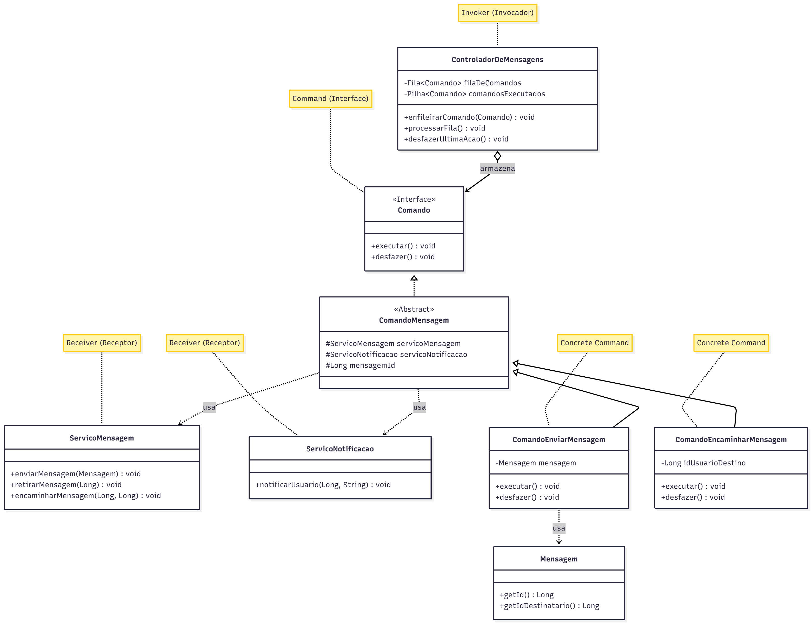

# Padrão Command

## 1. Introdução

O padrão Command é um padrão de projeto **comportamental** que converte solicitações em objetos independentes [[1](#ref1),[2](#ref2)]. No contexto do **CorreioDigital**, este padrão é aplicado para gerenciar o sistema de mensagens e notificações, permitindo que diferentes tipos de comunicações sejam processadas, registradas e controladas de forma consistente.

## 2. Metodologia

O desenvolvimento do padrão Command no CorreioDigital seguiu as seguintes etapas:

1. **Análise do Sistema**
   - Identificação dos tipos de mensagens do sistema
   - Mapeamento dos fluxos de comunicação
   - Definição dos requisitos de entrega e notificação

2. **Implementação**
   - Desenvolvimento das interfaces de comando
   - Criação dos comandos específicos para mensagens
   - Integração com o sistema de notificações

## Implementação

A implementação utiliza a anotação @Service do Spring Framework para a injeção de dependências [[3](#ref3)] e se inspira conceitualmente na ideia de filas de mensagens, similar à especificação JMS [[4](#ref4)], para o processamento assíncrono.

### Estrutura Base

```java
// Interface que define o contrato de um comando
public interface Comando {
    void executar();
    void desfazer();
}

// Classe abstrata para comandos relacionados a mensagens, evitando duplicação de código
public abstract class ComandoMensagem implements Comando {
    protected final ServicoMensagem servicoMensagem;
    protected final ServicoNotificacao servicoNotificacao;
    protected final Long mensagemId;

    public ComandoMensagem(ServicoMensagem servicoMensagem, 
                           ServicoNotificacao servicoNotificacao, 
                           Long mensagemId) {
        this.servicoMensagem = servicoMensagem;
        this.servicoNotificacao = servicoNotificacao;
        this.mensagemId = mensagemId;
    }
}
```

### Comandos Concretos

```java
// Comando para enviar uma nova mensagem
public class ComandoEnviarMensagem extends ComandoMensagem {
    private final Mensagem mensagem;

    public ComandoEnviarMensagem(ServicoMensagem servicoMensagem, 
                                 ServicoNotificacao servicoNotificacao, 
                                 Mensagem mensagem) {
        super(servicoMensagem, servicoNotificacao, mensagem.getId());
        this.mensagem = mensagem;
    }

    @Override
    public void executar() {
        servicoMensagem.enviarMensagem(mensagem);
        servicoNotificacao.notificarUsuario(mensagem.getIdDestinatario(), "Nova mensagem recebida!");
    }

    @Override
    public void desfazer() {
        servicoMensagem.retirarMensagem(mensagemId);
        servicoNotificacao.notificarUsuario(mensagem.getIdDestinatario(), "Mensagem retirada pelo remetente");
    }
}

// Comando para encaminhar uma mensagem existente
public class ComandoEncaminharMensagem extends ComandoMensagem {
    private final Long idUsuarioDestino;

    public ComandoEncaminharMensagem(ServicoMensagem servicoMensagem, ServicoNotificacao servicoNotificacao, 
                                     Long mensagemId, Long idUsuarioDestino) {
        super(servicoMensagem, servicoNotificacao, mensagemId);
        this.idUsuarioDestino = idUsuarioDestino;
    }

    @Override
    public void executar() {
        servicoMensagem.encaminharMensagem(mensagemId, idUsuarioDestino);
        servicoNotificacao.notificarUsuario(idUsuarioDestino, "Mensagem encaminhada recebida");
    }

    @Override
    public void desfazer() {
        // A lógica para desfazer um encaminhamento pode variar.
        // Aqui, assumimos que existe um método para deletar a cópia encaminhada.
        servicoMensagem.excluirMensagemEncaminhada(mensagemId, idUsuarioDestino);
    }
}
```

### Controlador de Mensagens

```java
@Service
public class ControladorDeMensagens {
    private final Queue<Comando> filaDeComandos;
    private final Stack<Comando> comandosExecutados;
    private final ServicoMensagem servicoMensagem;
    private final ServicoNotificacao servicoNotificacao;

    @Autowired
    public ControladorDeMensagens(ServicoMensagem servicoMensagem, ServicoNotificacao servicoNotificacao) {
        this.servicoMensagem = servicoMensagem;
        this.servicoNotificacao = servicoNotificacao;
        this.filaDeComandos = new LinkedList<>();
        this.comandosExecutados = new Stack<>();
    }

    // Cliente usa este método para criar e enfileirar uma nova solicitação
    public void enfileirarEnvioDeMensagem(Mensagem mensagem) {
        Comando comando = new ComandoEnviarMensagem(servicoMensagem, servicoNotificacao, mensagem);
        filaDeComandos.offer(comando);
    }

    // Processa os comandos da fila de forma assíncrona
    public void processarFila() {
        while (!filaDeComandos.isEmpty()) {
            Comando comando = filaDeComandos.poll();
            comando.executar();
            comandosExecutados.push(comando);
        }
    }

    // Desfaz o último comando que foi executado
    public void desfazerUltimaAcao() {
        if (!comandosExecutados.isEmpty()) {
            Comando comando = comandosExecutados.pop();
            comando.desfazer();
        }
    }
}
```

### Exemplo de Uso no Sistema

```java
@Service
public class ServicoDeModeracao {
    private final ControladorModeracao controlador;
    private final ServicoDePostagem servicoDePostagem;

    @Autowired
    public ServicoDeModeracao(ServicoDePostagem servicoDePostagem) {
        this.controlador = new ControladorModeracao();
        this.servicoDePostagem = servicoDePostagem;
    }

    public void ocultarPostagem(Long postagemId) {
        ComandoModeracao comando = new ComandoOcultarPostagem(servicoDePostagem, postagemId);
        controlador.executarComando(comando);
    }

    public void fixarPostagem(Long postagemId) {
        ComandoModeracao comando = new ComandoFixarPostagem(servicoDePostagem, postagemId);
        controlador.executarComando(comando);
    }

    public void desfazerUltimaAcao() {
        controlador.desfazerUltimo();
    }

    public void refazerUltimaAcao() {
        controlador.refazerUltimo();
    }
}
```

### Diagrama UML da Implementação


<center>
<font size="3"><p style="text-align: center"><b>Figura 1:</b> Diagrama de Classes do Command no CorreioDigital</p></font>
</center>

## Considerações de Projeto

### Vantagens Obtidas no CorreioDigital
- **Gerenciamento Assíncrono de Mensagens**
  - Enfileiramento de mensagens para processamento ordenado
  - Garantia de entrega mesmo em caso de falhas temporárias
  
- **Rastreabilidade**
  - Registro completo do fluxo de mensagens
  - Auditoria de entrega e recebimento
  
- **Flexibilidade Operacional**
  - Capacidade de desfazer envios equivocados
  - Suporte a diferentes tipos de mensagens e notificações

### Pontos de Atenção
- **Performance**
  - Monitoramento do tamanho da fila de mensagens
  - Gestão eficiente do histórico de comandos

- **Consistência**
  - Garantia de ordem de entrega
  - Tratamento de falhas durante o processamento


## Conclusão
O Command provou ser uma solução eficaz e robusta para o gerenciamento de operações no sistema CorreioDigital. Ao encapsular cada solicitação como um objeto, o padrão desacoplou com sucesso os componentes que iniciam uma ação (clientes) daqueles que a executam (serviços).

Isso resultou em um design mais flexível e extensível, onde novas funcionalidades, como diferentes tipos de mensagens ou ações de moderação, podem ser adicionadas com baixo impacto no código existente. A estrutura implementada, com um ControladorDeMensagens que gerencia uma fila e um histórico, não só atende aos requisitos básicos, mas também fornece uma base sólida para funcionalidades avançadas, como processamento assíncrono, rastreabilidade de ações e a capacidade de desfazer operações.

Conclui-se, portanto, que a escolha do padrão Command foi apropriada, resultando em um código mais limpo, organizado e preparado para futuras evoluções do sistema.

## Bibliografia

1. <a id="ref1"></a>GAMMA, E. et al. Design Patterns: Elements of Reusable Object-Oriented Software. Addison-Wesley, 1994.
2. <a id="ref2"></a>FREEMAN, E. et al. Head First Design Patterns. O'Reilly Media, 2004.
3. <a id="ref3"></a>Spring Framework Documentation. Available at: https://docs.spring.io/
4. <a id="ref4"></a>Java Message Service API. Available at: https://javaee.github.io/jms-spec/

## Histórico de Versões

| Versão |     Data    | Descrição   | Autor(es) | Revisor(es) | Detalhes da revisão | 
| ------ | ----------- | ----------- | --------- | ----------- | --------------------|
| `1.0`  | 16/10/2025 | Implementação inicial do Command                 |[Julia Gabriela](https://github.com/JuliaGabP) e [João Pedro Costa](https://github.com/johnaopedro)|-|-|
| `1.1`  | 17/10/2025 | Diagrama UML                 |[Julia Gabriela](https://github.com/JuliaGabP) e [João Pedro Costa](https://github.com/johnaopedro)|-|-|