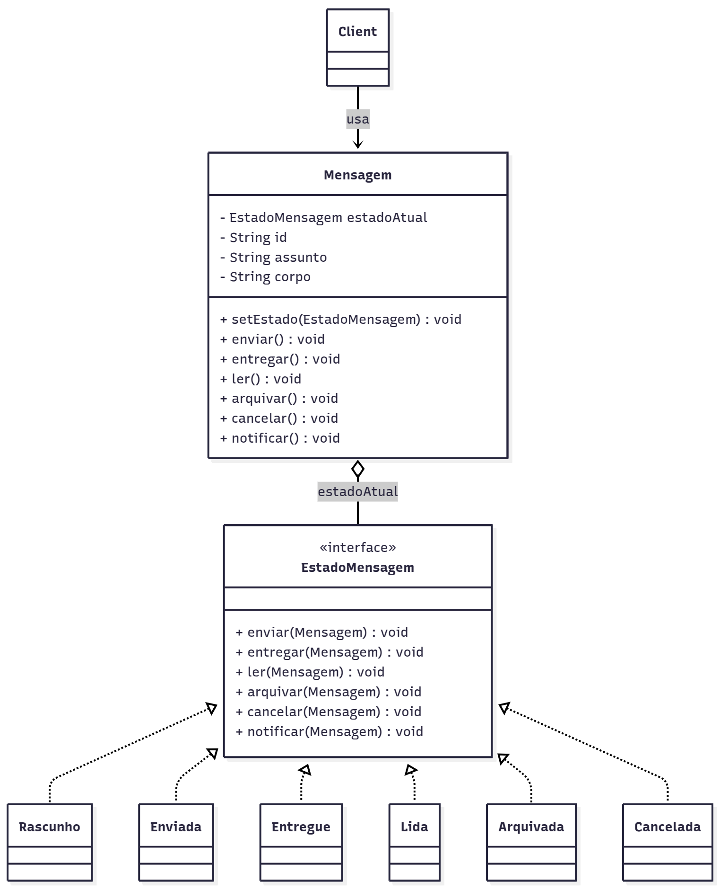

# Padrão State

## Introdução  
O padrão **State** — pertencente ao grupo dos **padrões comportamentais (GoF Behavioral)** — é aplicado para permitir que um objeto **altere dinamicamente seu comportamento** conforme seu estado interno muda, **sem a necessidade de condicionais complexas** ou múltiplos blocos `if-else` [1](https://refactoring.guru/pt-br/design-patterns/state).

Em sistemas de correio eletrônico, diversos componentes apresentam **mudanças de comportamento ao longo do tempo**, especialmente no ciclo de vida de uma mensagem. A aplicação do padrão permite que cada **estado encapsule seu próprio comportamento**, tornando o código mais modular, flexível e fácil de manter.

Exemplos de aplicação direta no projeto:
- Ciclo de vida de uma mensagem: `Rascunho`, `Enviada`, `Entregue`, `Lida`.
- Controle de notificações: mudança de comportamento ao passar de um estado para outro.
- Processamento de fila: mensagens em estados diferentes são tratadas com regras específicas.

- State. Disponível em: [https://refactoring.guru/pt-br/design-patterns/state](https://refactoring.guru/pt-br/design-patterns/state)

---

## Objetivo e Metodologia

**Objetivo** do uso do padrão **State** no sistema é **organizar e encapsular comportamentos que variam de acordo com o estado interno de um objeto**, garantindo que a aplicação possa evoluir sem necessidade de alterar diretamente o código principal. Isso resulta em **baixo acoplamento, alta coesão e melhor extensibilidade**.

**Metodologia**  
O processo de aplicação do padrão no projeto seguiu as seguintes etapas:  

1. **Compreensão teórica e estudo de exemplos:** Inicialmente, foi estudada a base conceitual do padrão através de aulas presenciais, videoaulas e exemplos práticos em Java.  
2. **Identificação de contextos adequados:** Foram mapeados componentes do sistema que mudam de comportamento conforme seu estado, principalmente o ciclo de vida das mensagens.  
3. **Modelagem dos estados:** Cada estado foi definido como uma classe concreta implementando uma interface comum, garantindo que o objeto principal delegue suas ações ao estado atual.  
4. **Implementação prática:** O objeto `Mensagem` passou a delegar seus métodos (`enviar`, `cancelar`, `notificar`) para objetos de estado concretos.  
5. **Integração ao sistema:** Os estados foram integrados ao módulo de mensagens, permitindo que a transição entre eles ocorra dinamicamente conforme ações do usuário ou eventos do sistema.

---



## Desenvolvimento

#### Interface de Estado (Component)

```java
public interface EstadoMensagem {
    void enviar(Mensagem mensagem);
    void cancelar(Mensagem mensagem);
    void notificar(Mensagem mensagem);
}
```

### Estados Concretos

#### Enviada

```java
public class Enviada implements EstadoMensagem {
    @Override
    public void enviar(Mensagem mensagem) {
        System.out.println("Mensagem já enviada.");
    }

    @Override
    public void cancelar(Mensagem mensagem) {
        System.out.println("Não é possível cancelar após o envio.");
    }

    @Override
    public void notificar(Mensagem mensagem) {
        System.out.println("Notificando que a mensagem foi enviada.");
    }
}
```
#### Lida

```java
public class Lida implements EstadoMensagem {
    @Override
    public void enviar(Mensagem mensagem) {
        System.out.println("Mensagem já foi lida, não é possível reenviar.");
    }

    @Override
    public void cancelar(Mensagem mensagem) {
        System.out.println("Não é possível cancelar uma mensagem lida.");
    }

    @Override
    public void notificar(Mensagem mensagem) {
        System.out.println("O destinatário leu a mensagem.");
    }
}
```

#### Rascunho

```java

public class Rascunho implements EstadoMensagem {
    @Override
    public void enviar(Mensagem mensagem) {
        System.out.println("Enviando mensagem...");
        mensagem.setEstado(new Enviada());
    }

    @Override
    public void cancelar(Mensagem mensagem) {
        System.out.println("Mensagem rascunho cancelada.");
    }

    @Override
    public void notificar(Mensagem mensagem) {
        System.out.println("Mensagem ainda em rascunho, nenhuma notificação.");
    }
}
```

#### Classe de Contexto

```java
public class Mensagem {
    private EstadoMensagem estado;

    public Mensagem() {
        this.estado = new Rascunho();
    }

    public void setEstado(EstadoMensagem estado) {
        this.estado = estado;
    }

    public void enviar() {
        estado.enviar(this);
    }

    public void cancelar() {
        estado.cancelar(this);
    }

    public void notificar() {
        estado.notificar(this);
    }
}
```

#### Exemplo de Uso

```java
public class Cliente {
    public static void main(String[] args) {
        Mensagem mensagem = new Mensagem();

        mensagem.enviar();      // muda para Enviada
        mensagem.notificar();   // notifica envio
        mensagem.cancelar();    // tentativa de cancelamento após envio
    }
}
```
## Justificativa de Uso 

### Pontos Positivos 
- **Alta coesão e baixo acoplamento:** A lógica de transição de estado fica encapsulada dentro de cada classe, facilitando a manutenção e a evolução do sistema.  
- **Facilidade de extensão:** Novos estados podem ser adicionados sem necessidade de alterar a estrutura existente, apenas criando novas classes que implementem a interface de estado.  
- **Comportamento dinâmico:** O objeto pode alterar seu comportamento em tempo de execução apenas mudando de estado, sem modificar sua interface externa.  
- **Melhor testabilidade:** Como cada estado é independente, é possível escrever testes unitários específicos para cada um, aumentando a confiabilidade do sistema.

### Pontos Negativos
- **Aumento no número de classes:** A implementação de cada estado como uma classe separada pode aumentar a quantidade de arquivos e a complexidade estrutural do projeto.  
- **Maior esforço inicial:** A definição da estrutura de estados e transições exige mais planejamento e tempo de desenvolvimento do que soluções condicionais simples.  
- **Sobrecarga cognitiva:** Em projetos menores ou com poucos estados, o uso do padrão pode ser considerado excessivo, tornando o código mais difícil de entender para novos desenvolvedores.

---

Neste contexto, os **benefícios superam as desvantagens**, especialmente porque a aplicação lida com fluxos complexos e variados — como o gerenciamento do ciclo de vida das mensagens e a mudança de estados da interface do usuário —, tornando o padrão **State** uma solução robusta, escalável e alinhada com boas práticas de engenharia de software.


## Bibliografia

- **State.** Disponível em: [https://refactoring.guru/pt-br/design-patterns/state](https://refactoring.guru/pt-br/design-patterns/state)  
- **GAMMA, E. et al.** *Design Patterns: Elements of Reusable Object-Oriented Software*. Addison-Wesley, 1994.  
- **SourceMaking - State Pattern Java.** Disponível em: [https://sourcemaking.com/design_patterns/state/java/5](https://sourcemaking.com/design_patterns/state/java/5)  
- **Arquitetura e Desenho de Software – Aula GoFs Comportamentais – Profa. Milene.** Disponível em: [https://aprender3.unb.br/pluginfile.php/3178398/mod_page/content/1/Arquitetura%20e%20Desenho%20de%20Software%20-%20Aula%20GoFs%20Estruturais%20-%20Profa.%20Milene.pdf](https://aprender3.unb.br/pluginfile.php/3178398/mod_page/content/1/Arquitetura%20e%20Desenho%20de%20Software%20-%20Aula%20GoFs%20Estruturais%20-%20Profa.%20Milene.pdf)

## Histórico de Versões

| Versão | Data       | Descrição                | Autor(es)                                            | Revisor(es) | Detalhes da revisão |
|--------|------------|--------------------------|-------------------------------------------------------|-------------|----------------------|
| `1.0`  | 17/10/2025 | Criação do documento State | [Thales Germano](https://github.com/thalesgvl)        | -           | -                    |

