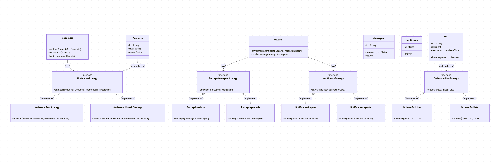

# Padrão Strategy

## 1. Introdução

O padrão de projeto **Strategy** é um padrão comportamental que tem como objetivo definir uma família de algoritmos, encapsulá-los de forma independente e torná-los intercambiáveis durante a execução de um sistema. Esse padrão é amplamente utilizado quando existe a necessidade de oferecer diferentes comportamentos para uma mesma funcionalidade, sem que seja preciso alterar o código da classe principal que utiliza esses comportamentos. Em essência, o Strategy promove a separação entre **a lógica do contexto** e **as estratégias de execução**, permitindo que o sistema seja facilmente extensível e configurável conforme diferentes cenários [1](https://refactoring.guru/pt-br/design-patterns/strategy).  

Outra característica importante é que o Strategy favorece a aplicação do **Princípio do Aberto/Fechado (OCP)**, já que novos algoritmos podem ser adicionados sem modificar o código existente. Além disso, esse padrão incentiva a utilização da **composição ao invés da herança**, promovendo maior flexibilidade e reduzindo o acoplamento entre os componentes [2](https://www.devmedia.com.br/estudo-e-aplicacao-do-padrao-de-projeto-strategy/25856).  

No contexto de sistemas orientados a objetos, o Strategy é bastante aplicável em casos como ordenação de elementos, cálculos de tarifas, processamento de pagamentos, algoritmos de recomendação e até moderação de conteúdo em plataformas digitais. Assim, ele representa uma solução robusta e elegante para a manutenção e evolução de softwares complexos [3](https://www-digitalocean-com.translate.goog/community/tutorials/strategy-design-pattern-in-java-example-tutorial?_x_tr_sl=en&_x_tr_tl=pt&_x_tr_hl=pt&_x_tr_pto=tc&_x_tr_hist=true).

## 2. Metodologia

A aplicação do padrão **Strategy** neste projeto foi conduzida a partir da identificação de pontos do sistema onde a flexibilidade de comportamento era essencial. Foram analisadas funcionalidades como a moderação de postagens e usuários, a ordenação de posts por diferentes critérios, a entrega de mensagens (imediata ou agendada) e a forma de envio de notificações. Em cada um desses casos, observou-se que existiam múltiplas formas de execução possíveis, o que justificou a adoção desse padrão [1](https://refactoring.guru/pt-br/design-patterns/strategy).  

A metodologia consistiu, primeiramente, na criação de **interfaces abstratas** representando as estratégias genéricas. Em seguida, foram implementadas classes concretas que encapsulam comportamentos específicos, como `ModeracaoPostStrategy` e `ModeracaoUsuarioStrategy`, ou ainda `OrdenarPorLikes` e `OrdenarPorData`. Por fim, as classes principais (como `Usuario`, `Moderador` e `Mensagem`) foram adaptadas apenas para permitir a utilização dessas estratégias, sem que houvesse necessidade de alterar sua lógica interna.  

Dessa forma, garantiu-se que o projeto mantivesse alta **coesão interna** e baixo **acoplamento externo**, princípios fundamentais da Arquitetura de Software. O processo de escolha e aplicação das estratégias foi guiado por reuniões de grupo, discussões sobre casos de uso práticos e pelo critério de reduzir a complexidade de manutenção futura, garantindo que o código possa ser expandido de forma incremental e sustentável [3](https://www-digitalocean-com.translate.goog/community/tutorials/strategy-design-pattern-in-java-example-tutorial?_x_tr_sl=en&_x_tr_tl=pt&_x_tr_hl=pt&_x_tr_pto=tc&_x_tr_hist=true).

## Implementação

**Figura 1:** Diagrama UML Padrão Strategy  



### Aplicação em código

O padrão Strategy foi aplicado para permitir que cada funcionalidade do sistema como moderação, ordenação de posts, envio de mensagens e notificações, possa ter múltiplas variações de comportamento intercambiáveis, sem alterar o código das classes principais. Os componentes concretos podem ser encontrados [aqui](/docs/PadroesDeProjeto/GoFsCriacionais/factorymethod.md).

**Moderação**

A estratégia de Moderação define diferentes abordagens para o tratamento de denúncias dentro da plataforma. Por meio desse padrão, o sistema pode aplicar ações específicas conforme o tipo de denúncia, seja analisando publicações reportadas ou gerenciando usuários que violam as diretrizes, sem modificar a lógica central do moderador.

```java
interface ModeracaoStrategy {
    void analisar(Denuncia denuncia, Moderador moderador);
}

class ModeracaoPostStrategy implements ModeracaoStrategy {
    @Override
    public void analisar(Denuncia denuncia, Moderador moderador) {
        System.out.println("[Strategy] Revisando post denunciado...");
        if (denuncia.getPost() != null && denuncia.getPost().isInadequado()) {
            moderador.excluirPost(denuncia.getPost());
            denuncia.resolve("Post removido via strategy");
        } else {
            denuncia.resolve("Post está adequado");
        }
    }
}

class ModeracaoUsuarioStrategy implements ModeracaoStrategy {
    @Override
    public void analisar(Denuncia denuncia, Moderador moderador) {
        if (denuncia.getReportedUser() != null) {
            moderador.banirUsuario(denuncia.getReportedUser());
            denuncia.resolve("Usuário banido via strategy");
        } else {
            denuncia.resolve("Denúncia sem usuário associado");
        }
    }
}
```

**Ordenação de Posts**

A estratégia de Ordenação de Posts permite que o sistema adapte dinamicamente a forma como as publicações são exibidas aos usuários. Assim, é possível alternar entre diferentes critérios de priorização, como número de curtidas ou data de criação, garantindo maior flexibilidade na personalização do feed.

```java
interface OrdenacaoPostStrategy {
    List<Post> ordenar(List<Post> posts);
}

class OrdenarPorLikes implements OrdenacaoPostStrategy {
    @Override
    public List<Post> ordenar(List<Post> posts) {
        posts.sort((a, b) -> b.likes - a.likes);
        return posts;
    }
}

class OrdenarPorData implements OrdenacaoPostStrategy {
    @Override
    public List<Post> ordenar(List<Post> posts) {
        posts.sort((a, b) -> b.createdAt.compareTo(a.createdAt));
        return posts;
    }
}
```

**Entrega de Mensagens**

A estratégia de Entrega de Mensagens foi projetada para definir diferentes modos de envio de mensagens dentro do chat. Ela permite que o sistema alterne entre entregas imediatas e agendadas, mantendo o comportamento modular e facilmente extensível a novos tipos de envio.

```java
interface EntregaMensagemStrategy {
    void entregar(Mensagem m);
}

class EntregaImediata implements EntregaMensagemStrategy {
    @Override
    public void entregar(Mensagem m) {
        System.out.println("[Entrega imediata] " + m.summary());
        m.deliver();
    }
}

class EntregaAgendada implements EntregaMensagemStrategy {
    @Override
    public void entregar(Mensagem m) {
        System.out.println("[Entrega agendada] Mensagem " + m.summary() + " será enviada em 5 minutos.");
    }
}

```

**Notificações**

A estratégia de Notificações implementa diferentes níveis de prioridade para o envio de alertas aos usuários. Essa abordagem torna o sistema mais flexível e adaptável, permitindo distinguir entre notificações simples e urgentes de forma transparente e reutilizável.

```java
interface NotificacaoStrategy {
    void enviar(Notificacao n);
}

class NotificacaoSimples implements NotificacaoStrategy {
    @Override
    public void enviar(Notificacao n) {
        n.deliver();
    }
}

class NotificacaoUrgente implements NotificacaoStrategy {
    @Override
    public void enviar(Notificacao n) {
        System.out.println("🚨 URGENTE 🚨");
        n.deliver();
    }
}
```

### Exemplo de Uso

O exemplo de uso a seguir demonstra, de forma prática, como as diferentes estratégias implementadas no sistema podem ser aplicadas em situações reais, como a moderação de denúncias, a ordenação de publicações, o envio de mensagens e notificações. Ele mostra a interação entre usuários e moderadores, ilustrando como o padrão Strategy permite alternar dinamicamente o comportamento das funcionalidades sem modificar o código principal das classes envolvidas.

```java
class StrategyDemo {
    public static void main(String[] args) {
        // Criando perfil e usuários
        Perfil p1 = new Perfil("João", "Aprendendo inglês");
        Usuario joao = new Usuario("u1", "joao", "joao@email.com", p1);

        Perfil p2 = new Perfil("Maria", "Moderadora ativa");
        Moderador maria = new Moderador("u2", "maria", "maria@email.com", p2);

        // Criando um post denunciado
        Post post = new PostTexto("p1", joao, "Conteúdo suspeito...");
        Denuncia denuncia = new Denuncia("d1", joao, "post", "spam");
        denuncia.attachPost(post);

        // Aplicando estratégia de moderação
        ModeracaoStrategy modStrategy = new ModeracaoPostStrategy();
        modStrategy.analisar(denuncia, maria);

        // Estratégia de ordenação de posts
        List<Post> posts = new ArrayList<>();
        posts.add(post);
        posts.add(new PostTexto("p2", maria, "Olá comunidade!"));

        OrdenacaoPostStrategy ordem = new OrdenarPorData();
        ordem.ordenar(posts);

        // Estratégia de envio de mensagens
        Mensagem msg = new MensagemTexto("m1", joao, maria, "Oi Maria!");
        EntregaMensagemStrategy entrega = new EntregaImediata();
        entrega.entregar(msg);

        // Estratégia de notificação
        Notificacao notif = new NotificacaoMensagem("n1", joao, "Nova amizade sugerida!");
        NotificacaoStrategy notifStrat = new NotificacaoUrgente();
        notifStrat.enviar(notif);
    }
}
```


## Bibliografia

1. Refactoring.Guru. *Padrão Strategy*. Disponível em: [https://refactoring.guru/pt-br/design-patterns/strategy](https://refactoring.guru/pt-br/design-patterns/strategy). Acesso em: 19 out. 2025.  
2. DevMedia. *Padrão de Projeto Strategy em Java*. Disponível em: [https://www.devmedia.com.br/estudo-e-aplicacao-do-padrao-de-projeto-strategy/25856](https://www.devmedia.com.br/estudo-e-aplicacao-do-padrao-de-projeto-strategy/25856). Acesso em: 19 out. 2025.  
3. DigitalOcean. *Strategy Design Pattern in Java*. Disponível em: [https://www-digitalocean-com.translate.goog/community/tutorials/strategy-design-pattern-in-java-example-tutorial?_x_tr_sl=en&_x_tr_tl=pt&_x_tr_hl=pt&_x_tr_pto=tc&_x_tr_hist=true](https://www-digitalocean-com.translate.goog/community/tutorials/strategy-design-pattern-in-java-example-tutorial?_x_tr_sl=en&_x_tr_tl=pt&_x_tr_hl=pt&_x_tr_pto=tc&_x_tr_hist=true). Acesso em: 19 out. 2025.  

## Histórico de Versões

| Versão |     Data    | Descrição   | Autor(es) | Revisor(es) | Detalhes da revisão | 
| ------ | ----------- | ----------- | --------- | ----------- | --------------------|
| `1.0`  | 19/10/2025 | Criação do esqueleto do documento |[Túlio Augusto Celeri](https://github.com/TulioCeleri) e [Pedro Ferreira Gondim](https://github.com/G0ndim)|-|-|
| `1.1`  | 19/10/2025 | Criação da introdução, metodogia e diagrama UML do padrão strategy |[Túlio Augusto Celeri](https://github.com/TulioCeleri) e [Pedro Ferreira Gondim](https://github.com/G0ndim)|-|-|
| `1.2`  | 20/10/2025  | Adição da implementação em código do strategy | [Pedro Ferreira Gondim](https://github.com/G0ndim) e [Túlio Augusto Celeri](https://github.com/TulioCeleri) |-|-|