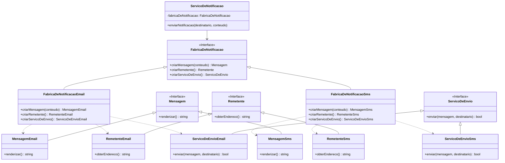

## **1. Introdução**

O Abstract Factory é um padrão de projeto criacional do GoF (Gang of Four) que visa fornecer uma interface para a criação de famílias de objetos relacionados ou dependentes, sem a necessidade de especificar suas classes concretas. Essencialmente, o padrão encapsula um grupo de fábricas individuais que possuem um tema em comum, permitindo que o código cliente crie objetos que pertencem a uma mesma família, garantindo sua compatibilidade.

No contexto do projeto **CorreioDigital**, este padrão será utilizado para gerenciar a criação de diferentes tipos de notificações (E-mail, SMS, etc.), onde cada tipo constitui uma "família" de objetos (mensagem, remetente, serviço de envio).

## **2. Problema**

O sistema **CorreioDigital** precisa de um mecanismo flexível para enviar notificações aos usuários através de múltiplos canais. Inicialmente, podemos ter canais como E-mail e SMS, mas a arquitetura deve estar preparada para a futura inclusão de outros, como Notificações Push ou mensagens no WhatsApp.

Cada canal de notificação possui um conjunto específico de componentes:

  * Um objeto **Mensagem**, que precisa ser formatado de acordo com o canal (HTML para e-mail, texto puro para SMS).
  * Um objeto **Remetente**, que contém as informações de origem (um endereço de e-mail ou um número de telefone).
  * Um **Serviço de Envio**, responsável pela lógica de comunicação com a API ou o gateway específico do canal.

Uma abordagem ingênua seria instanciar esses objetos diretamente no código cliente usando condicionais (`if/else` ou `switch`) para decidir qual conjunto de classes criar. Essa abordagem leva a um forte acoplamento entre o cliente e as classes concretas, violando o Princípio Aberto-Fechado (Open-Closed Principle). Qualquer adição de um novo canal de notificação exigiria a modificação de todos os pontos no código onde as notificações são criadas, tornando a manutenção complexa e propensa a erros.

## **3. Solução**

Para resolver esse problema, aplicaremos o padrão Abstract Factory. A solução consiste em definir uma interface abstrata, `FabricaDeNotificacao`, que declara métodos para criar cada um dos objetos da família de notificação (`criarMensagem`, `criarRemetente`, `criarServicoDeEnvio`).

Para cada canal de notificação suportado, criaremos uma fábrica concreta que implementa essa interface. Por exemplo:

  * `FabricaDeNotificacaoEmail`: Será responsável por instanciar `MensagemEmail`, `RemetenteEmail` e `ServicoDeEnvioEmail`.
  * `FabricaDeNotificacaoSms`: Será responsável por instanciar `MensagemSms`, `RemetenteSms` e `ServicoDeEnvioSms`.

O código cliente (`ServicoDeNotificacao`) dependerá apenas da interface `FabricaDeNotificacao`. Ele receberá uma instância de uma fábrica concreta (via injeção de dependência, por exemplo) e a utilizará para criar a família de objetos de que precisa, sem nunca conhecer as implementações específicas. Isso garante que o cliente sempre usará um conjunto coeso e compatível de objetos.

## **4. Estrutura (Diagrama UML)**

A imagem do diagrama a seguir ilustra a estrutura das classes e interfaces envolvidas na solução.

**Diagrama mermaid:**



#### 4.1. Modelagem do Factory Method para Conteúdo

A figura 1 abaixo mostra a modelagem do campo Conteúdo feita manualmente

<div align="center">
    Figura 1: modelagem do campo Conteúdo
    <br>
    
    <br>
    <b>Autoras:</b> <a href="https://github.com/esmsena">Esther Sena</a> e <a href="https://github.com/Maryyscreuza">Mariiana Siqueira</a>. 
    <br> 
</div>

## **5. Participantes**

  * **`FabricaDeNotificacao` (AbstractFactory)**: Interface que declara as operações de criação para cada produto abstrato (ex: `criarMensagem()`).
  * **`FabricaDeNotificacaoEmail`, `FabricaDeNotificacaoSms` (ConcreteFactory)**: Classes que implementam a `AbstractFactory` para criar uma família de produtos concretos.
  * **`Mensagem`, `Remetente`, `ServicoDeEnvio` (AbstractProduct)**: Interfaces que definem os produtos que a fábrica pode criar.
  * **`MensagemEmail`, `MensagemSms`, etc. (ConcreteProduct)**: Implementações concretas dos produtos que são criados pelas fábricas concretas.
  * **`ServicoDeNotificacao` (Client)**: A classe que utiliza as interfaces `AbstractFactory` e `AbstractProduct` para realizar seu trabalho, permanecendo desacoplada das implementações concretas.

## **6. Consequências da Utilização do Padrão**

**Vantagens:**

  * **Isolamento das Classes Concretas:** O cliente não depende das classes concretas dos produtos. A troca de famílias de produtos se torna trivial, bastando alterar a classe da fábrica concreta utilizada.
  * **Consistência entre Produtos:** O padrão garante que os objetos criados por uma fábrica são da mesma família e projetados para funcionar juntos, evitando inconsistências.
  * **Promove o Princípio Aberto-Fechado:** É fácil introduzir novas variantes (famílias) de produtos (ex: Notificação Push) sem modificar o código cliente existente. Basta criar uma nova fábrica concreta e suas respectivas classes de produto.
  * **Alta Coesão:** O código relacionado à criação de uma família de objetos fica centralizado em uma única classe de fábrica.

**Desvantagens:**

  * **Aumento da Complexidade:** A introdução do padrão adiciona várias novas interfaces e classes ao sistema, o que pode aumentar a complexidade inicial do código.
  * **Dificuldade para Adicionar Novos Produtos:** Adicionar um novo tipo de produto à família (ex: um `Anexo`) exige a alteração da interface da `AbstractFactory` e de todas as suas subclasses concretas, o que pode ser uma mudança custosa.

## **7. Exemplo de Implementação (Pseudocódigo/Java)**

**1. Interfaces dos Produtos (AbstractProduct)**

<details>
  <summary><strong>Código para `Interfaces dos Produtos`</strong></summary>

```java
// Interface para a Mensagem
public interface Message {
    String render();
}

// Interface para o Remetente
public interface Sender {
    String getFromAddress();
}

// Interface para o Serviço de Envio
public interface DeliveryService {
    boolean send(String recipient, Message message);
}
```
##### Imagem do código no VSCODE

As figuras 1 e 2 abaixo ilustra a estrutura da classe `public interface Message` no ambiente de desenvolvimento VSCode.


<div align="center"> 
  <b>Figura 1 – Interface Message.java</b><br> 
  <br> <b>Autoras:</b> <a href="https://github.com/esmsena">Esther Sena</a> e <a href="https://github.com/Maryyscreuza">Mariiana Siqueira</a> </div>
  
  <div align="center"> 
    <b>Figura 2 – Interface Message.java</b><br> <br> 
  <b>Autoras:</b> <a href="https://github.com/esmsena">Esther Sena</a> e <a href="https://github.com/Maryyscreuza">Mariiana Siqueira</a> </div> 
  
  </details> ```


**2. Fábrica Abstrata (AbstractFactory)**

```java
public interface NotificationFactory {
    Message createMessage(String content);
    Sender createSender();
    DeliveryService createDeliveryService();
}
```


**3. Implementações Concretas para E-mail (ConcreteFactory e ConcreteProducts)**

```java
// Produto Concreto
public class EmailMessage implements Message {
    private String content;
    public EmailMessage(String content) { this.content = content; }
    @Override public String render() { return "<html><body>" + content + "</body></html>"; }
}

// Produto Concreto
public class EmailSender implements Sender {
    @Override public String getFromAddress() { return "contato@correiodigital.com"; }
}

// Produto Concreto
public class EmailDeliveryService implements DeliveryService {
    @Override public boolean send(String recipient, Message message) {
        System.out.println("Enviando E-MAIL para: " + recipient);
        System.out.println("Conteúdo: " + message.render());
        return true;
    }
}

// Fábrica Concreta
public class EmailNotificationFactory implements NotificationFactory {
    @Override
    public Message createMessage(String content) {
        return new EmailMessage(content);
    }

    @Override
    public Sender createSender() {
        return new EmailSender();
    }

    @Override
    public DeliveryService createDeliveryService() {
        return new EmailDeliveryService();
    }
}
```

**4. Cliente (Client)**

O cliente decide qual fábrica usar com base em alguma configuração ou parâmetro, e o resto do código funciona de forma agnóstica ao tipo de notificação.

```java
public class NotificationService {
    private NotificationFactory factory;

    // A fábrica concreta é injetada no cliente
    public NotificationService(NotificationFactory factory) {
        this.factory = factory;
    }

    public void sendNotification(String recipient, String content) {
        // O cliente usa a fábrica para criar os produtos
        Message message = factory.createMessage(content);
        Sender sender = factory.createSender(); // Poderia ser usado para logging, etc.
        DeliveryService deliveryService = factory.createDeliveryService();

        // O serviço de envio usa os produtos criados
        deliveryService.send(recipient, message);
    }
}

// Exemplo de uso
public class Main {
    public static void main(String[] args) {
        // Para enviar um e-mail
        NotificationFactory emailFactory = new EmailNotificationFactory();
        NotificationService emailService = new NotificationService(emailFactory);
        emailService.sendNotification("usuario@email.com", "Sua fatura chegou!");

        // Para enviar um SMS (a implementação seria similar à de e-mail)
        // NotificationFactory smsFactory = new SmsNotificationFactory();
        // NotificationService smsService = new NotificationService(smsFactory);
        // smsService.sendNotification("+5561999999999", "Sua fatura chegou!");
    }
}
```

#### 7.7\. Benefícios da Abordagem

  * **Isolamento das Classes Concretas**: O cliente interage apenas com as interfaces (`NotificationFactory`, `Message`). As implementações concretas podem ser trocadas facilmente sem alterar o código do cliente.
  * **Facilidade para Adicionar Novos Canais**: Para adicionar suporte a notificações *Push*, basta criar uma `PushNotificationFactory` e as classes de produto correspondentes (`PushMessage`, etc.). Nenhuma alteração é necessária no `NotificationService`.
  * **Consistência entre Produtos**: O padrão garante que os objetos criados por uma fábrica são da mesma família e, portanto, compatíveis entre si. Você nunca misturará um `SmsMessage` com um `EmailDeliveryService`.
  * **Alta Coesão e Baixo Acoplamento**: A responsabilidade de criar uma família de objetos fica centralizada na fábrica concreta, promovendo um design mais limpo e organizado.

## **8. Referências**

  * GAMMA, E. et al. **Padrões de Projeto: Soluções Reutilizáveis de Software Orientado a Objetos**. Bookman, 2000.
  * Refactoring Guru - Abstract Factory: [https://refactoring.guru/design-patterns/abstract-factory](https://refactoring.guru/design-patterns/abstract-factory)


## Histórico de Versões

| Versão | Data       | Descrição  | Autor(es) | Revisor(es) | Detalhes  da revisão |
|--------|-----------|-----------------------------|-----------|-------------|----------|
| `1.0`  | 25/09/2025 | Criação inicial do documento e Criação e evolução do documento com inclusão progressiva dos cenários de Introdução, Problemas, Solução, Estrutura (Diagrama UML mermaid), Participantes, Consequências da Utilização do Padrão, Vantagens, Desvantagens, Exemplo de Código (Java), Referências. |[Esther Sena](https://github.com/esmsena) | - | - |
