## **Introdução**

O Abstract Factory é um padrão de projeto criacional do GoF (Gang of Four) que visa fornecer uma interface para a criação de famílias de objetos relacionados ou dependentes, sem a necessidade de especificar suas classes concretas. Essencialmente, o padrão encapsula um grupo de fábricas individuais que possuem um tema em comum, permitindo que o código cliente crie objetos que pertencem a uma mesma família, garantindo sua compatibilidade.

No contexto do projeto **CorreioDigital**, este padrão será utilizado para gerenciar a criação de diferentes tipos de notificações (E-mail, SMS, etc.), onde cada tipo constitui uma "família" de objetos (mensagem, remetente, serviço de envio).

[[2](#ref2)]

## **Metodologia**

Este documento foi elaborado por Mariiana Siqueira e Esther Sena segundo uma abordagem iterativa e incremental. Inicialmente foi definido o escopo e estrutura, seguida de pesquisa bibliográfica sobre o padrão Abstract Factory. Em seguida, elaboramos um esboço com texto, diagramas e exemplo de código, que foi revisado internamente. Posteriormente, implementamos e testamos o exemplo de código para validar a correção e coerência com o texto. 

[[1](#ref1),[2](#ref2)]

## **Problema**

O sistema **CorreioDigital** precisa de um mecanismo flexível para enviar notificações aos usuários através de múltiplos canais. Inicialmente, podemos ter canais como E-mail e SMS, mas a arquitetura deve estar preparada para a futura inclusão de outros, como Notificações Push ou mensagens no WhatsApp.

Cada canal de notificação possui um conjunto específico de componentes:

  * Um objeto **Mensagem**, que precisa ser formatado de acordo com o canal (HTML para e-mail, texto puro para SMS).
  * Um objeto **Remetente**, que contém as informações de origem (um endereço de e-mail ou um número de telefone).
  * Um **Serviço de Envio**, responsável pela lógica de comunicação com a API ou o gateway específico do canal.

Uma abordagem ingênua seria instanciar esses objetos diretamente no código cliente usando condicionais (`if/else` ou `switch`) para decidir qual conjunto de classes criar. Essa abordagem leva a um forte acoplamento entre o cliente e as classes concretas, violando o Princípio Aberto-Fechado (Open-Closed Principle). Qualquer adição de um novo canal de notificação exigiria a modificação de todos os pontos no código onde as notificações são criadas, tornando a manutenção complexa e propensa a erros.

[[2](#ref2)]

## **Solução**

Para resolver esse problema, aplicaremos o padrão Abstract Factory. A solução consiste em definir uma interface abstrata, `FabricaDeNotificacao`, que declara métodos para criar cada um dos objetos da família de notificação (`criarMensagem`, `criarRemetente`, `criarServicoDeEnvio`).

Para cada canal de notificação suportado, criaremos uma fábrica concreta que implementa essa interface. Por exemplo:

  * `FabricaDeNotificacaoEmail`: Será responsável por instanciar `MensagemEmail`, `RemetenteEmail` e `ServicoDeEnvioEmail`.
  * `FabricaDeNotificacaoSms`: Será responsável por instanciar `MensagemSms`, `RemetenteSms` e `ServicoDeEnvioSms`.

O código cliente (`ServicoDeNotificacao`) dependerá apenas da interface `FabricaDeNotificacao`. Ele receberá uma instância de uma fábrica concreta (via injeção de dependência, por exemplo) e a utilizará para criar a família de objetos de que precisa, sem nunca conhecer as implementações específicas. Isso garante que o cliente sempre usará um conjunto coeso e compatível de objetos.

[[1](#ref1),[2](#ref2)],[3](#ref3),[6](#ref6)]

## **Estrutura (Diagrama UML)**

A imagem do diagrama a seguir ilustra a estrutura das classes e interfaces envolvidas na solução.

**Diagrama mermaid:**

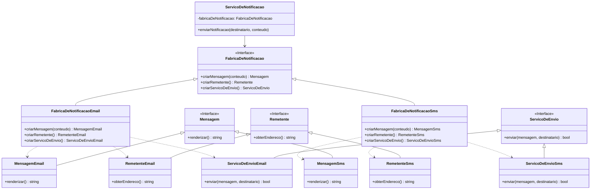

#### Modelagem do Factory Method para Conteúdo

A figura 1 abaixo mostra a modelagem do campo Conteúdo feita manualmente

<center>
<font size="3"><p style="text-align: center"><b>Figura 1:</b> Modelagem do campo Conteúdo</p></font>
</center>

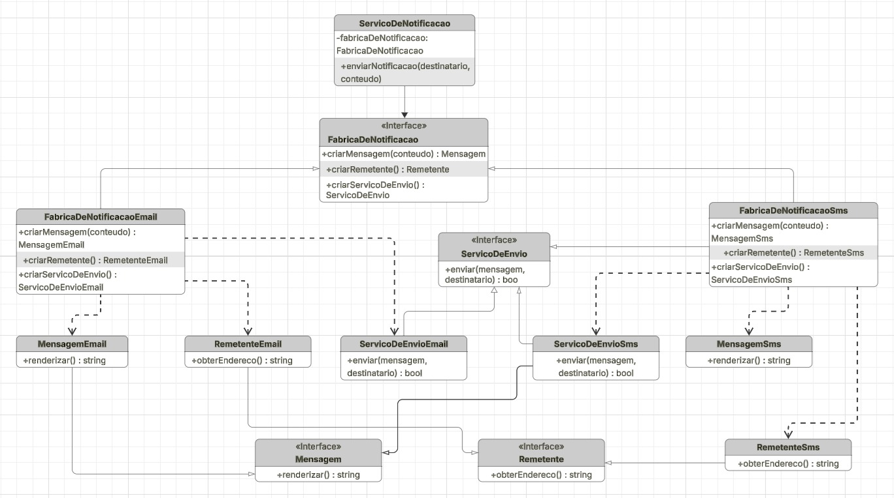

<center>
<font size="3"><p style="text-align: center"><b> Autoras:</b> <a href="https://github.com/esmsena">Esther Sena</a> e <a href="https://github.com/Maryyscreuza">Mariiana Siqueira</p></font>
</center>

[[3](#ref3),[6](#ref6)]

---

## **Participantes**

  * **`FabricaDeNotificacao` (AbstractFactory)**: Interface que declara as operações de criação para cada produto abstrato (ex: `criarMensagem()`).
  * **`FabricaDeNotificacaoEmail`, `FabricaDeNotificacaoSms` (ConcreteFactory)**: Classes que implementam a `AbstractFactory` para criar uma família de produtos concretos.
  * **`Mensagem`, `Remetente`, `ServicoDeEnvio` (AbstractProduct)**: Interfaces que definem os produtos que a fábrica pode criar.
  * **`MensagemEmail`, `MensagemSms`, etc. (ConcreteProduct)**: Implementações concretas dos produtos que são criados pelas fábricas concretas.
  * **`ServicoDeNotificacao` (Client)**: A classe que utiliza as interfaces `AbstractFactory` e `AbstractProduct` para realizar seu trabalho, permanecendo desacoplada das implementações concretas.

---

## **Consequências da Utilização do Padrão**

**Vantagens:**

  * **Isolamento das Classes Concretas:** O cliente não depende das classes concretas dos produtos. A troca de famílias de produtos se torna trivial, bastando alterar a classe da fábrica concreta utilizada.
  * **Consistência entre Produtos:** O padrão garante que os objetos criados por uma fábrica são da mesma família e projetados para funcionar juntos, evitando inconsistências.
  * **Promove o Princípio Aberto-Fechado:** É fácil introduzir novas variantes (famílias) de produtos (ex: Notificação Push) sem modificar o código cliente existente. Basta criar uma nova fábrica concreta e suas respectivas classes de produto.
  * **Alta Coesão:** O código relacionado à criação de uma família de objetos fica centralizado em uma única classe de fábrica.

**Desvantagens:**

  * **Aumento da Complexidade:** A introdução do padrão adiciona várias novas interfaces e classes ao sistema, o que pode aumentar a complexidade inicial do código.
  * **Dificuldade para Adicionar Novos Produtos:** Adicionar um novo tipo de produto à família (ex: um `Anexo`) exige a alteração da interface da `AbstractFactory` e de todas as suas subclasses concretas, o que pode ser uma mudança custosa.

---

## **Implementação Real (Código Java)**

A implementação completa do padrão Abstract Factory está disponível na pasta `src/Criacionais/abstractfactory/` e inclui:

###  **Estrutura da Implementação**

```
src/Criacionais/abstractfactory/
├── interfaces/                    # Interfaces abstratas
│   ├── Message.java              # Interface para mensagens
│   ├── Sender.java               # Interface para remetentes
│   ├── DeliveryService.java      # Interface para serviços de envio
│   └── NotificationFactory.java  # AbstractFactory
├── email/                        # Família de produtos para E-mail
│   ├── EmailMessage.java
│   ├── EmailSender.java
│   ├── EmailDeliveryService.java
│   └── EmailNotificationFactory.java
├── sms/                          # Família de produtos para SMS
│   ├── SmsMessage.java
│   ├── SmsSender.java
│   ├── SmsDeliveryService.java
│   └── SmsNotificationFactory.java
├── client/                       # Cliente do padrão
│   └── NotificationService.java
├── Main.java                     # Exemplo de uso
└── README.md                     # Documentação técnica
```

### **Como Executar a Implementação**

```bash
# Navegar para o diretório
cd src/Criacionais/abstractfactory

# Compilar o projeto
javac -cp . Main.java

# Executar o exemplo
java -cp . Main
```

###  **Exemplo de Uso**

```java
// Para enviar notificação por E-mail
NotificationFactory emailFactory = new EmailNotificationFactory();
NotificationService emailService = new NotificationService(emailFactory);
emailService.sendNotification("usuario@email.com", "Sua fatura chegou!");

// Para enviar notificação por SMS
NotificationFactory smsFactory = new SmsNotificationFactory();
NotificationService smsService = new NotificationService(smsFactory);
smsService.sendNotification("+5561999999999", "Sua fatura chegou!");
```

###  **Benefícios da Implementação**

1. **Código Funcional**: Implementação completa e testável
2. **Estrutura Modular**: Separação clara de responsabilidades
3. **Fácil Extensão**: Adicionar novos canais sem modificar código existente
4. **Documentação Técnica**: README.md com instruções detalhadas
5. **Exemplo Prático**: Main.java demonstra o uso do padrão


 [[5](#ref5)]

---

## **Detalhes da Implementação (Código Java)**

**1. Interfaces dos Produtos (AbstractProduct)**

<details>
  <summary>Arquivos: `interfaces/Message.java`, `interfaces/Sender.java`, `interfaces/DeliveryService.java`</strong></summary>

```java
// Arquivo: interfaces/Message.java
public interface Message {
    String render();
}

// Arquivo: interfaces/Sender.java  
public interface Sender {
    String getFromAddress();
}

// Arquivo: interfaces/DeliveryService.java
public interface DeliveryService {
    boolean send(String recipient, Message message);
}
```
##### Imagem do código no VSCODE

As figuras 1, 2 e 3 abaixo ilustram a estrutura das interfaces `public interface Message`, `public interface Sender` e `public interface DeliveryService` no ambiente de desenvolvimento VSCode.

<div align="center"> 
  <b>Figura 1 – Interface Message.java</b><br> 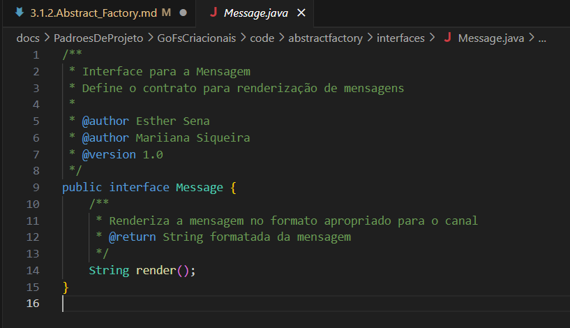
  <br> <b>Autoras:</b> <a href="https://github.com/esmsena">Esther Sena</a> e <a href="https://github.com/Maryyscreuza">Mariiana Siqueira</a> </div>
  
  <div align="center"> 
    <b>Figura 2 – Interface Sender.java</b><br> 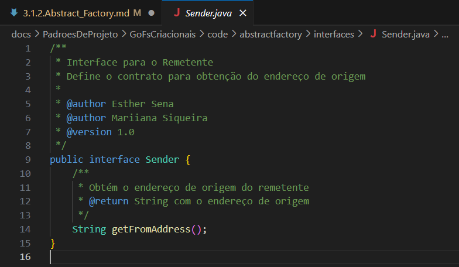<br> 
  <b>Autoras:</b> <a href="https://github.com/esmsena">Esther Sena</a> e <a href="https://github.com/Maryyscreuza">Mariiana Siqueira</a> </div> 

<div align="center"> 
    <b>Figura 3 – Interface DeliveryService.java</b><br> 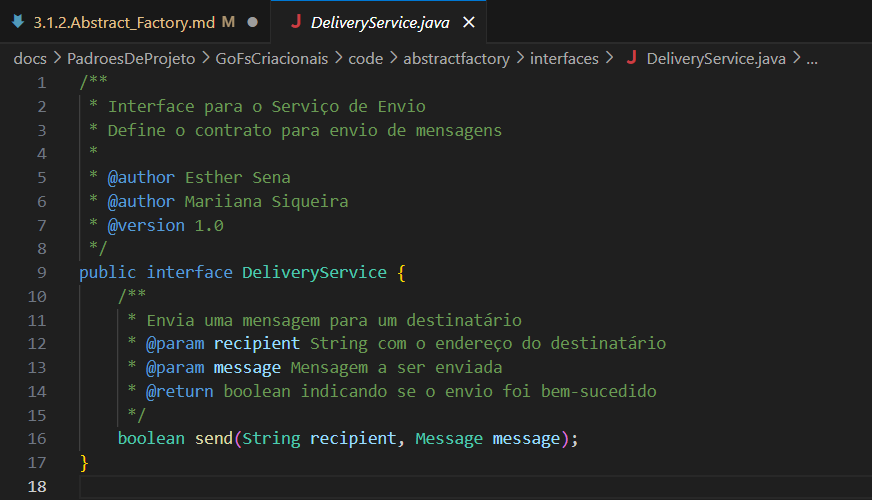<br> 
  <b>Autoras:</b> <a href="https://github.com/esmsena">Esther Sena</a> e <a href="https://github.com/Maryyscreuza">Mariiana Siqueira</a> </div> 
  
  </details> 

**2. Fábrica Abstrata (AbstractFactory)**

<details>
  <summary>Arquivo: `interfaces/NotificationFactory.java`</strong></summary>

```java
// Arquivo: interfaces/NotificationFactory.java
public interface NotificationFactory {
    Message createMessage(String content);
    Sender createSender();
    DeliveryService createDeliveryService();
}
```

##### Imagem do código no VSCODE

A figura 4 abaixo ilustra a estrutura da interface `public interface Notification Factory` no ambiente de desenvolvimento VSCode.

<div align="center"> 
  <b>Figura 4 – Interface NotificationFactory.java</b><br> 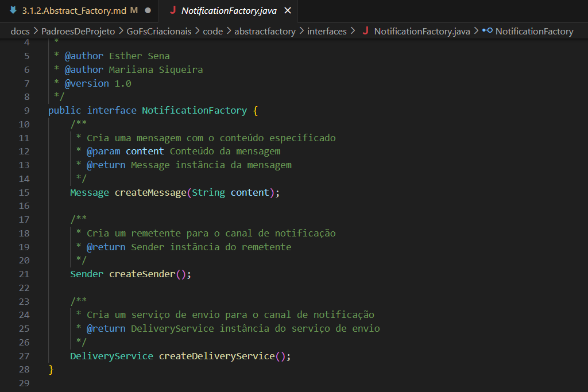
  <br> <b>Autoras:</b> <a href="https://github.com/esmsena">Esther Sena</a> e <a href="https://github.com/Maryyscreuza">Mariiana Siqueira</a> </div>
  
  </details> 

**3. Implementações Concretas para E-mail (ConcreteFactory e ConcreteProducts)**

<details>
  <summary>Arquivos: `email/EmailMessage.java`, `email/EmailSender.java`, `email/EmailDeliveryService.java`, `email/EmailNotificationFactory.java`</strong></summary>

```java
// Arquivo: email/EmailMessage.java
public class EmailMessage implements Message {
    private String content;
    public EmailMessage(String content) { this.content = content; }
    @Override public String render() { return "<html><body>" + content + "</body></html>"; }
}

// Arquivo: email/EmailSender.java
public class EmailSender implements Sender {
    @Override public String getFromAddress() { return "contato@correiodigital.com"; }
}

// Arquivo: email/EmailDeliveryService.java
public class EmailDeliveryService implements DeliveryService {
    @Override public boolean send(String recipient, Message message) {
        System.out.println("Enviando E-MAIL para: " + recipient);
        System.out.println("Conteúdo: " + message.render());
        return true;
    }
}

// Arquivo: email/EmailNotificationFactory.java
public class EmailNotificationFactory implements NotificationFactory {
    @Override
    public Message createMessage(String content) {
        return new EmailMessage(content);
    }

    @Override
    public Sender createSender() {
        return new EmailSender();
    }

    @Override
    public DeliveryService createDeliveryService() {
        return new EmailDeliveryService();
    }
}
```

##### Imagem do código no VSCODE

As figuras 5, 6, 7 e 8 abaixo ilustram a estrutura das classes `public class EmailMessage`, `public class EmailSender`, `public class EmailDeliveryService`, e `public class EmailNotificationFactory` no ambiente de desenvolvimento VSCode.

<div align="center"> 
  <b>Figura 5 – Classe EmailMessage.java</b><br> 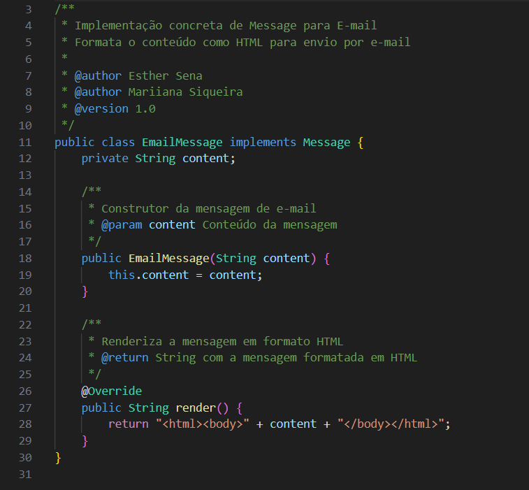
  <br> <b>Autoras:</b> <a href="https://github.com/esmsena">Esther Sena</a> e <a href="https://github.com/Maryyscreuza">Mariiana Siqueira</a> </div>

<div align="center"> 
  <b>Figura 6 – Classe EmailSender.java</b><br> 
  <br> <b>Autoras:</b> <a href="https://github.com/esmsena">Esther Sena</a> e <a href="https://github.com/Maryyscreuza">Mariiana Siqueira</a> </div>

<div align="center"> 
  <b>Figura 7 – Classe EmailDeliveryService.java</b><br> 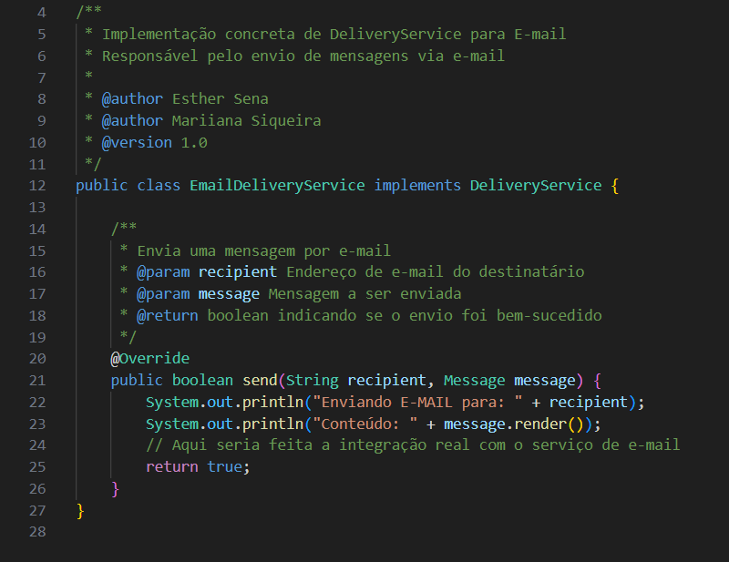
  <br> <b>Autoras:</b> <a href="https://github.com/esmsena">Esther Sena</a> e <a href="https://github.com/Maryyscreuza">Mariiana Siqueira</a> </div>

<div align="center"> 
  <b>Figura 8 – Classe EmailNotificationFactory.java</b><br> 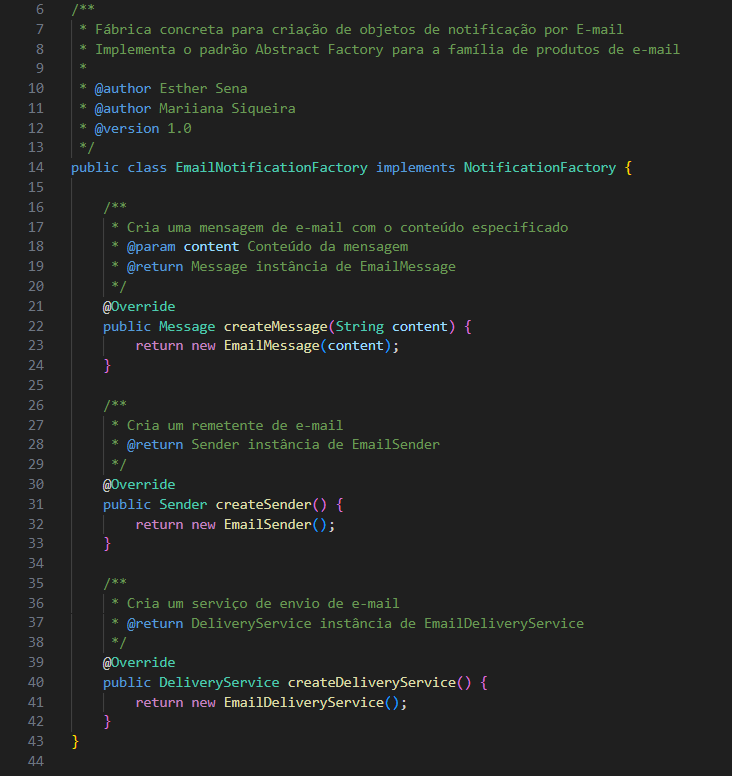
  <br> <b>Autoras:</b> <a href="https://github.com/esmsena">Esther Sena</a> e <a href="https://github.com/Maryyscreuza">Mariiana Siqueira</a> </div>

  </details> 

  
**4. Cliente (Client)**

<details>
  <summary>Arquivos: `client/NotificationService.java`, `Main.java`</strong></summary>

O cliente decide qual fábrica usar com base em alguma configuração ou parâmetro, e o resto do código funciona de forma agnóstica ao tipo de notificação.

```java
// Arquivo: client/NotificationService.java
public class NotificationService {
    private NotificationFactory factory;

    // A fábrica concreta é injetada no cliente
    public NotificationService(NotificationFactory factory) {
        this.factory = factory;
    }

    public void sendNotification(String recipient, String content) {
        // O cliente usa a fábrica para criar os produtos
        Message message = factory.createMessage(content);
        Sender sender = factory.createSender(); // Poderia ser usado para logging, etc.
        DeliveryService deliveryService = factory.createDeliveryService();

        // O serviço de envio usa os produtos criados
        deliveryService.send(recipient, message);
    }
}

// Arquivo: Main.java - Exemplo de uso
public class Main {
    public static void main(String[] args) {
        // Para enviar um e-mail
        NotificationFactory emailFactory = new EmailNotificationFactory();
        NotificationService emailService = new NotificationService(emailFactory);
        emailService.sendNotification("usuario@email.com", "Sua fatura chegou!");

        // Para enviar um SMS
        NotificationFactory smsFactory = new SmsNotificationFactory();
        NotificationService smsService = new NotificationService(smsFactory);
        smsService.sendNotification("+5561999999999", "Sua fatura chegou!");
    }
}
```

##### Imagem do código no VSCODE

As figuras 9 e 10 abaixo ilustram a estrutura das classes `public class NotificationService` e `public class Main` no ambiente de desenvolvimento VSCode.

<div align="center"> 
  <b>Figura 9 – Classe NotificationService.java</b><br> 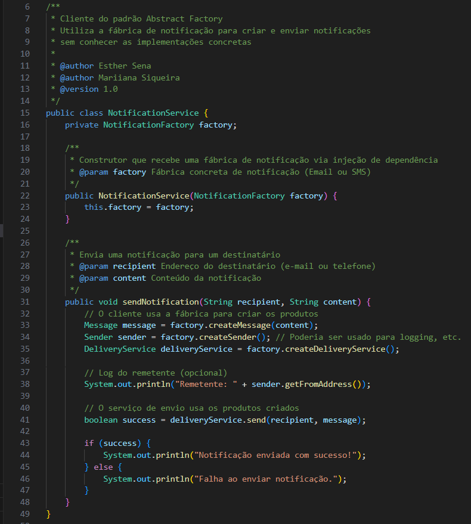
  <br> <b>Autoras:</b> <a href="https://github.com/esmsena">Esther Sena</a> e <a href="https://github.com/Maryyscreuza">Mariiana Siqueira</a> </div>

<div align="center"> 
  <b>Figura 10 – Classe Main.java</b><br> 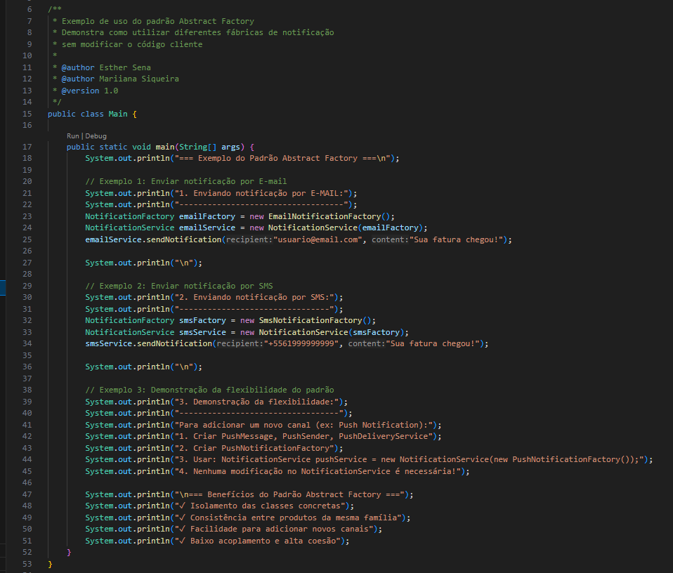
  <br> <b>Autoras:</b> <a href="https://github.com/esmsena">Esther Sena</a> e <a href="https://github.com/Maryyscreuza">Mariiana Siqueira</a> </div>

  </details> 

  
**5. Implementações Concretas para SMS (ConcreteFactory e ConcreteProducts)**

<details>
  <summary>Arquivos: `sms/SmsMessage.java`, `sms/SmsSender.java`, `sms/SmsDeliveryService.java`, `sms/SmsNotificationFactory.java`</strong></summary>

```java
// Arquivo: sms/SmsMessage.java
public class SmsMessage implements Message {
    private String content;
    public SmsMessage(String content) { this.content = content; }
    @Override public String render() { return content; } // SMS usa texto puro
}

// Arquivo: sms/SmsSender.java
public class SmsSender implements Sender {
    @Override public String getFromAddress() { return "+5561999999999"; }
}

// Arquivo: sms/SmsDeliveryService.java
public class SmsDeliveryService implements DeliveryService {
    @Override public boolean send(String recipient, Message message) {
        System.out.println("Enviando SMS para: " + recipient);
        System.out.println("Conteúdo: " + message.render());
        return true;
    }
}

// Arquivo: sms/SmsNotificationFactory.java
public class SmsNotificationFactory implements NotificationFactory {
    @Override
    public Message createMessage(String content) {
        return new SmsMessage(content);
    }

    @Override
    public Sender createSender() {
        return new SmsSender();
    }

    @Override
    public DeliveryService createDeliveryService() {
        return new SmsDeliveryService();
    }
}
```

##### Imagem do código no VSCODE

As figuras 11, 12, 13 e 14 abaixo ilustram a estrutura das classes `public class SmsMessage`, `public class SmsSender`, `public class SmsDeliveryService`, e `public class SmsNotificationFactory` no ambiente de desenvolvimento VSCode.

<div align="center"> 
  <b>Figura 11 – Classe SmsMessage.java</b><br> 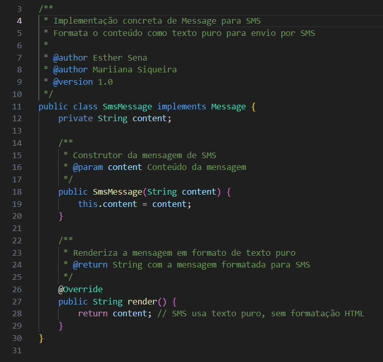
  <br> <b>Autoras:</b> <a href="https://github.com/esmsena">Esther Sena</a> e <a href="https://github.com/Maryyscreuza">Mariiana Siqueira</a> </div>

<div align="center"> 
  <b>Figura 12 – Classe SmsSender.java</b><br> 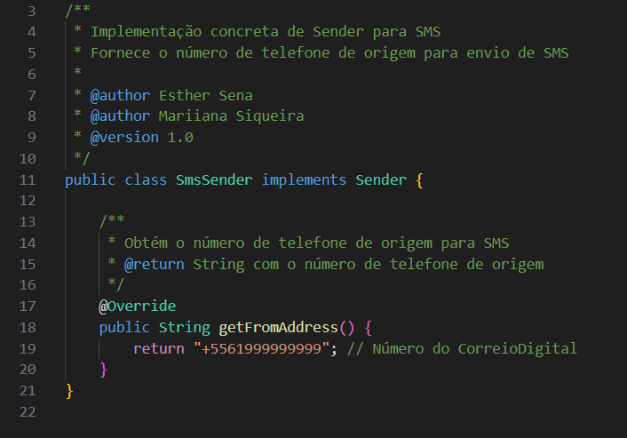
  <br> <b>Autoras:</b> <a href="https://github.com/esmsena">Esther Sena</a> e <a href="https://github.com/Maryyscreuza">Mariiana Siqueira</a> </div>

<div align="center"> 
  <b>Figura 13 – Classe SmsDeliveryService.java</b><br> 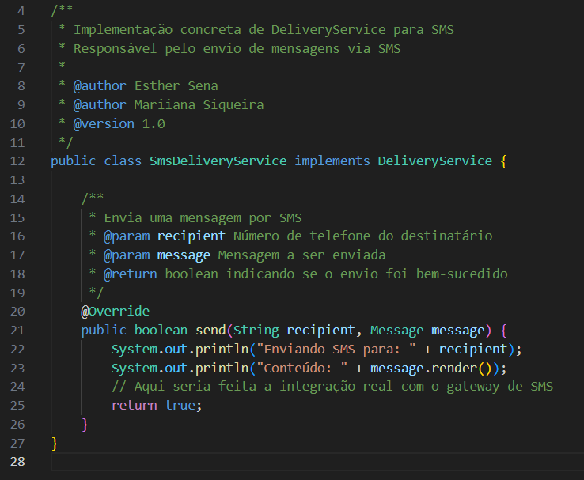
  <br> <b>Autoras:</b> <a href="https://github.com/esmsena">Esther Sena</a> e <a href="https://github.com/Maryyscreuza">Mariiana Siqueira</a> </div>

<div align="center"> 
  <b>Figura 14 – Classe SmsNotificationFactory.java</b><br> 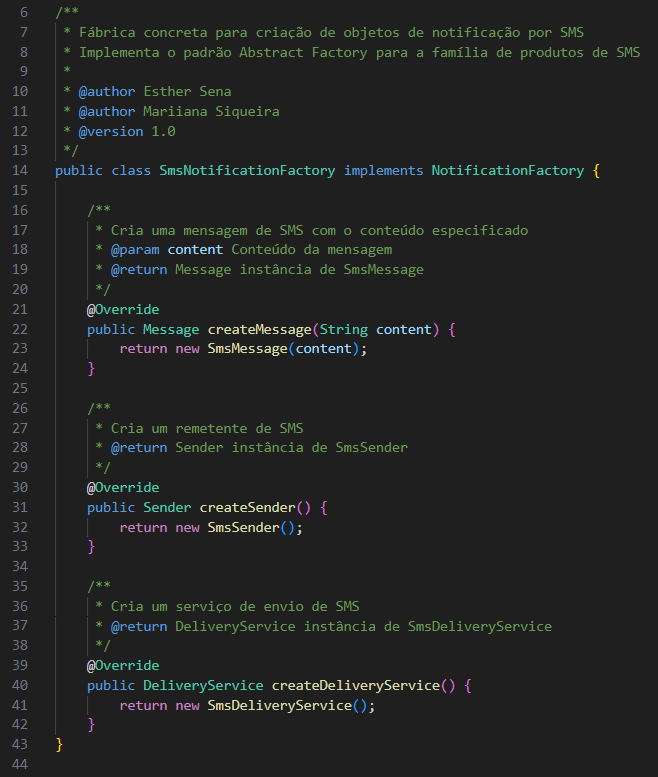
  <br> <b>Autoras:</b> <a href="https://github.com/esmsena">Esther Sena</a> e <a href="https://github.com/Maryyscreuza">Mariiana Siqueira</a> </div>
  

  </details> 

 [[4](#ref5),[5](#ref5)]
 
  ----

 
  
####  **Benefícios da Abordagem**

  * **Isolamento das Classes Concretas**: O cliente interage apenas com as interfaces (`NotificationFactory`, `Message`). As implementações concretas podem ser trocadas facilmente sem alterar o código do cliente.
  * **Facilidade para Adicionar Novos Canais**: Para adicionar suporte a notificações *Push*, basta criar uma `PushNotificationFactory` e as classes de produto correspondentes (`PushMessage`, etc.). Nenhuma alteração é necessária no `NotificationService`.
  * **Consistência entre Produtos**: O padrão garante que os objetos criados por uma fábrica são da mesma família e, portanto, compatíveis entre si. Você nunca misturará um `SmsMessage` com um `EmailDeliveryService`.
  * **Alta Coesão e Baixo Acoplamento**: A responsabilidade de criar uma família de objetos fica centralizada na fábrica concreta, promovendo um design mais limpo e organizado.

  *  [[3](#ref3),[6](#ref6)]

---

## **Referências**

  1. <a id="ref1"></a>SERRANO, M. Arquitetura e Desenho de Software – Aula GoFs Criacionais. Universidade de Brasília, 2025. Material em PDF fornecido em aula.
  2. <a id="ref2">GAMMA, E. et al. **Padrões de Projeto: Soluções Reutilizáveis de Software Orientado a Objetos**. Bookman, 2000.
  3. <a id="ref3">Refactoring Guru - Abstract Factory: [https://refactoring.guru/design-patterns/abstract-factory](https://refactoring.guru/design-patterns/abstract-factory)
  4. <a id="ref4">SIERRA, K.; BATES, B. Use a Cabeça! Java. Rio de Janeiro: Alta Books, 2005.
  5. <a id="ref5">REFATORING.GURU. Abstract Factory in Java. Disponível em: https://refactoring.guru/pt-br/design-patterns/abstract-factory/java/example. Acesso em: 25 set. 2025.
  6. <a id="ref6">SOURCEMAKING. Abstract Factory Design Pattern. Disponível em: https://sourcemaking.com/design_patterns/abstract_factory. Acesso em: 22 set. 2025.


---

## Histórico de Versões

| Versão | Data       | Descrição  | Autor(es) | Revisor(es) | Detalhes  da revisão |
|--------|-----------|-----------------------------|-----------|-------------|----------|
| `1.0`  | 25/09/2025 | Criação inicial do documento e Criação e evolução do documento com inclusão progressiva dos cenários de Introdução, Problemas, Solução, Estrutura (Diagrama UML mermaid), Participantes, Consequências da Utilização do Padrão, Vantagens, Desvantagens, Exemplo de Código (Java), Referências. |[Esther Sena](https://github.com/esmsena) | - | - |
| `1.1`  | 26/09/2025 | Edição documental e estrutural, adicionando referencias utilizadas e deixando os tópicos da seção 7 organizados com menus que facilitaram o estudo do documento . |[Esther Sena](https://github.com/esmsena) | - | - |
| `1.2`  | 06/10/2025 | Revisão documental e adição de códigos de cada classe separada no documento, adição também da modelagem do campo Conteúdo|[Mariiana Siqueira](https://github.com/Maryyscreuza) | - | - |
| `1.3`  | 06/10/2025 | Arrumando caminho das imagens e corrigindo imagem das classes SmsMessage.java, SmsSender.java, SmsDeliveryService.java, SmsNotificationFactory.java|[Mariiana Siqueira](https://github.com/Maryyscreuza) | - | - |
| `1.4`  | 13/10/2025 | Atualiando metodologia pós revisão do pull request |[Mariiana Siqueira](https://github.com/Maryyscreuza) | - | - |
| `1.5`  | 21/10/2025 | Reorganização da estrutura: código movido de `docs/` para `src/Criacionais/abstractfactory/` e linkagem nas referencias |[Esther Sena](https://github.com/esmsena) | - | - |
| `1.6`  | 21/10/2025 | Ajustando estrutura documental |[Esther Sena](https://github.com/esmsena) | - | - |
