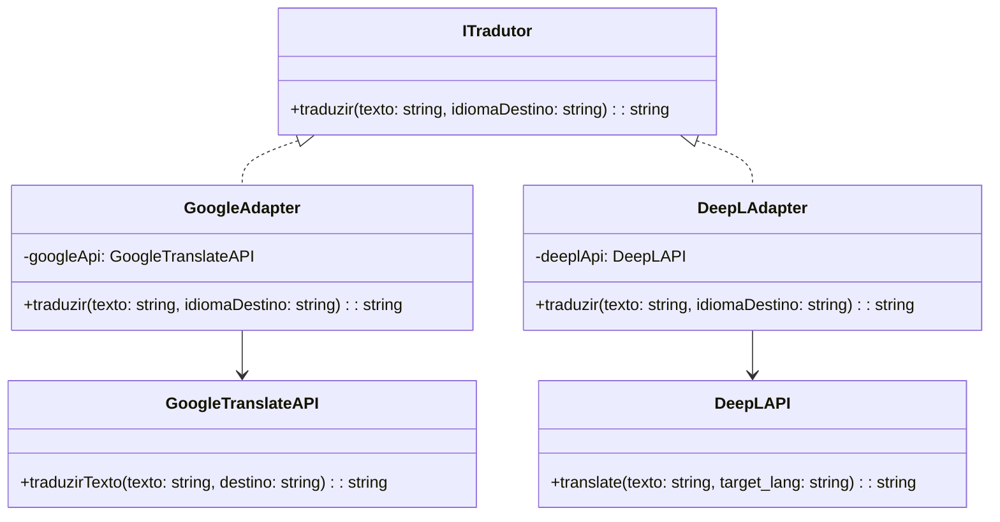
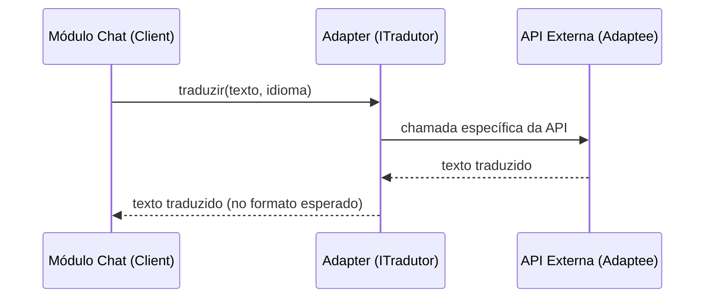
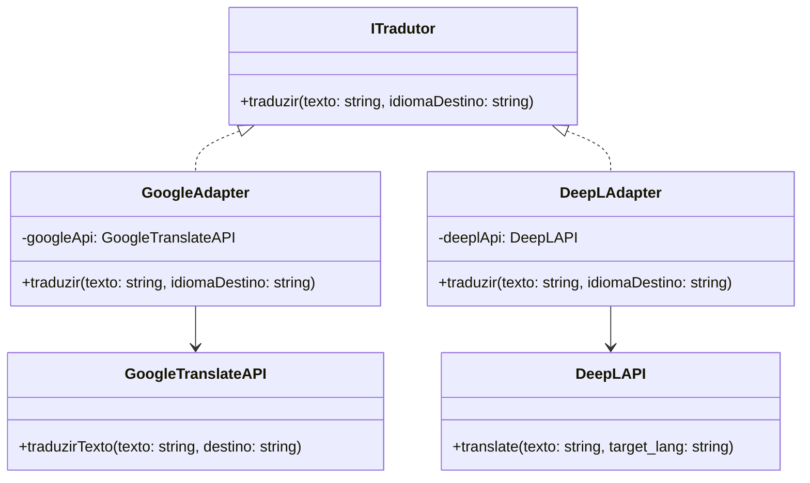
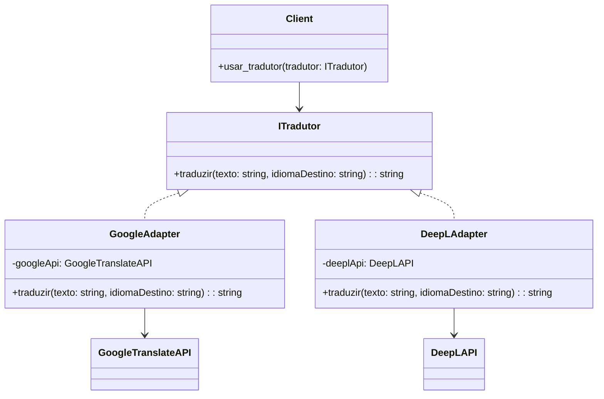
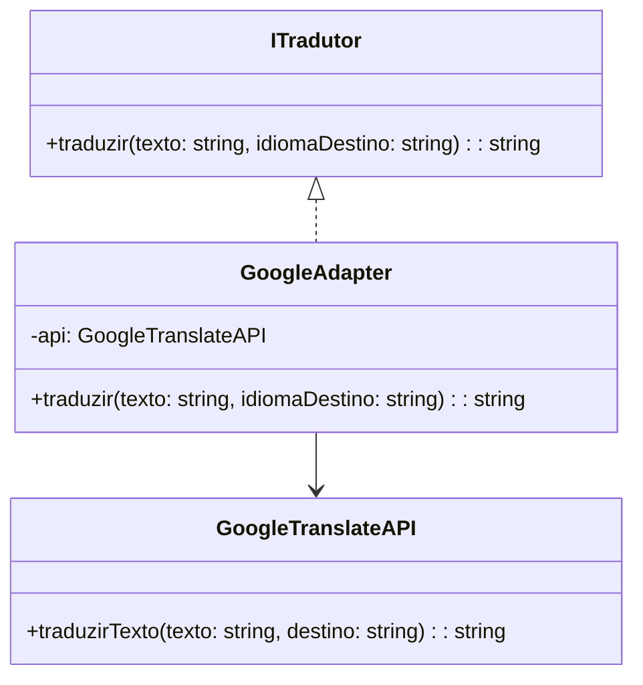

# Padrão de Projeto: Adapter (GoF Estrutural)

## Introdução
O padrão Adapter, pertencente ao grupo de padrões estruturais da Gang of Four (GoF), tem como principal função permitir que classes com interfaces incompatíveis possam trabalhar juntas. Ele atua como um tradutor entre diferentes componentes do sistema, convertendo chamadas de uma interface para outra esperada pelo cliente.  

No contexto do CorreioDigital, esse padrão é aplicado para integrar o sistema com APIs externas de tradução automática, garantindo que o módulo de chat consiga traduzir mensagens de forma transparente, independentemente da API utilizada (ex.: Google Translate, DeepL, etc.). [[1](#ref1),[2](#ref2)]

---

## Objetivo/Metodologia
O objetivo do uso do padrão Adapter é desacoplar a lógica interna do CorreioDigital das APIs externas utilizadas para tradução de texto e notificações.  
A metodologia aplicada seguiu o modelo proposto pela Gang of Four (GoF), com análise do problema de incompatibilidade de interfaces, definição dos participantes (Target, Adapter, Adaptee e Client) e representação UML.  

A elaboração do artefato envolveu:
1. Identificação dos pontos de integração com dependências externas (APIs de tradução, notificações e autenticação).
2. Mapeamento das interfaces incompatíveis.
3. Definição de uma interface padrão (`ITradutor`).
4. Implementação de adaptadores para diferentes serviços externos.
5. Representação do fluxo de comunicação no diagrama UML.

[[1](#ref1),[2](#ref2)]

---

## Desenvolvimento (Adapter)
O Adapter permite que o módulo de chat do CorreioDigital realize traduções automáticas sem depender diretamente da API de terceiros. Assim, se for necessário trocar a API, basta alterar o adaptador, sem modificar o restante do código.

### 1. Estrutura UML
**Participantes:**
- **Client:** Módulo de Chat.
- **Target:** Interface esperada (`ITradutor`).
- **Adapter:** Classe intermediária que traduz as chamadas (`GoogleAdapter`, `DeepLAdapter`).
- **Adaptee:** API externa (`GoogleTranslateAPI`, `DeepLAPI`).




### 1.1 Quando usar

Use o padrão Adapter quando:

- Você precisa usar uma classe existente que não possui a interface exigida pelo seu código (incompatibilidade de interface).
- Deseja desacoplar o cliente de implementações concretas de bibliotecas ou serviços externos (facilitar testes e troca de provedor).
- Precisa criar uma camada de compatibilidade sem modificar a implementação da classe existente (adaptee).

Evite o Adapter quando a incompatibilidade puder ser resolvida com pequenos ajustes ou quando o padrão adicionaria complexidade desnecessária (ex.: wrappers triviais em casos de uso único).

Compare rapidamente com padrões próximos:

- Facade: provê uma interface simplificada para um conjunto de interfaces; não se concentra em compatibilidade entre duas interfaces distintas.
- Bridge: separa abstração da implementação para variar ambas independentemente; útil quando há hierarquias de abstração/implementação.
- Proxy: controla acesso ao objeto real (controle de acesso, lazy load); não transforma a interface.

  [[1](#ref1),[2](#ref2)]

### 1.2 Sequence Diagram (fluxo de chamada)



[[3](#ref3),[4](#ref4)]

---

### 2. Exemplos (3)

Este documento apresenta três exemplos didáticos do padrão Adapter:

- Exemplo 1 — Versão simples (histórica) em Python (mantém o exemplo original).
- Exemplo 2 — Versão robusta em Python (ITradutor como interface/ABC, adaptadores com tratamento de erro e fallback). Inclui teste pytest minimal.
- Exemplo 3 — Exemplo em TypeScript (Node.js) para ilustrar aplicação em projetos JS/TS.

[[3](#ref3),[4](#ref4)]

---

#### Exemplo 1 — Versão simples (histórico) — UML e código



```Python
class ITradutor:
    def traduzir(self, texto, idioma_destino):
        pass

class GoogleTranslateAPI:
    def traduzir_texto(self, texto, destino):
        print(f"Traduzindo '{texto}' para {destino} com Google Translate")

class GoogleAdapter(ITradutor):
    def __init__(self, google_api):
        self.google_api = google_api

    def traduzir(self, texto, idioma_destino):
        self.google_api.traduzir_texto(texto, destino=idioma_destino)

class DeepLAPI:
    def translate(self, texto, target_lang):
        print(f"Traduzindo '{texto}' para {target_lang} com DeepL")

class DeepLAdapter(ITradutor):
    def __init__(self, deepl_api):
        self.deepl_api = deepl_api

    def traduzir(self, texto, idioma_destino):
        self.deepl_api.translate(texto, target_lang=idioma_destino)
```

Contexto e uso (onde colocar no projeto):

- Contexto: exemplo didático mostrando a transformação direta de chamada do cliente para a API externa.
- Local sugerido no repo: `projeto/<modulo_chat>/integrations/traducao/simple_adapter.py` (arquivo didático).
- Observação: este exemplo mantém a forma original com prints para facilitar compreensão histórica.

---

#### Exemplo 2 — Versão robusta (Python sync) — UML, código e teste



```Python
from abc import ABC, abstractmethod

class TraducaoError(Exception):
    pass

class ITradutor(ABC):
    @abstractmethod
    def traduzir(self, texto: str, idioma_destino: str) -> str:
        pass

class GoogleTranslateAPI:
    def traduzir_texto(self, texto: str, destino: str) -> str:
        return f"[Google] {texto} -> {destino}"

class GoogleAdapter(ITradutor):
    def __init__(self, google_api: GoogleTranslateAPI):
        self.google_api = google_api

    def traduzir(self, texto: str, idioma_destino: str) -> str:
        try:
            return self.google_api.traduzir_texto(texto, destino=idioma_destino)
        except Exception as e:
            raise TraducaoError("Falha na tradução via Google") from e

class DeepLAPI:
    def translate(self, texto: str, target_lang: str) -> str:
        return f"[DeepL] {texto} -> {target_lang}"

class DeepLAdapter(ITradutor):
    def __init__(self, deepl_api: DeepLAPI):
        self.deepl_api = deepl_api

    def traduzir(self, texto: str, idioma_destino: str) -> str:
        try:
            return self.deepl_api.translate(texto, target_lang=idioma_destino)
        except Exception as e:
            raise TraducaoError("Falha na tradução via DeepL") from e

def traduz_com_fallback(texto: str, idioma: str, adaptadores: list[ITradutor]) -> str:
    for adaptador in adaptadores:
        try:
            return adaptador.traduzir(texto, idioma)
        except TraducaoError:
            continue
    return texto

# Uso (Client)
if __name__ == "__main__":
    google = GoogleAdapter(GoogleTranslateAPI())
    deepl = DeepLAdapter(DeepLAPI())
    print(traduz_com_fallback("Bom dia", "EN", [google, deepl]))
```

Contexto e integração no CorreioDigital:

- Contexto: cenário realístico onde múltiplos provedores de tradução podem ser usados e o sistema precisa ser resiliente a falhas e limites de quota.
- Local sugerido no repo: `projeto/chat/services/traducao/` com arquivos `interfaces.py`, `adapters.py` e `fallback.py`.
- Testes: mover o teste para `tests/test_adapter.py` para integração com a suíte de testes.


```Python
# Teste pytest para fallback
def test_traduz_com_fallback(monkeypatch):
    class FailAPI:
        def traduzir_texto(self, texto, destino):
            raise RuntimeError("Simulated failure")

    class SuccessAPI:
        def traduzir_texto(self, texto, destino):
            return "ok"

    fail_adapter = GoogleAdapter(FailAPI())
    success_adapter = GoogleAdapter(SuccessAPI())
    assert traduz_com_fallback("x", "EN", [fail_adapter, success_adapter]) == "ok"
```

---

#### Exemplo 3 — Exemplo em TypeScript (Node.js) — UML e código



```TypeScript
export interface ITradutor {
  traduzir(texto: string, idiomaDestino: string): string;
}

export class GoogleTranslateAPI {
  traduzirTexto(texto: string, destino: string): string {
    return `[Google] ${texto} -> ${destino}`;
  }
}

export class GoogleAdapter implements ITradutor {
  constructor(private api: GoogleTranslateAPI) {}

  traduzir(texto: string, idiomaDestino: string): string {
    return this.api.traduzirTexto(texto, idiomaDestino);
  }
}
```

Contexto e localização no projeto:

- Contexto: adaptação de payloads de APIs externas para os tipos/objetos do frontend do CorreioDigital (ex.: `MessageAPIAdapter` para normalizar o retorno das traduções antes de o chat exibi-las).  
- Local sugerido no repositório: `frontend/src/services/apiAdapters.ts` ou `projeto/frontend/src/services/apiAdapters.ts`.  
- Observação: prefira o Adapter por composição (Object Adapter) em TypeScript, encapsulando os serviços HTTP e expondo uma interface unificada ao frontend.


#### Exemplo de Client (uso)

```Python
def exemplo_uso_tradutor(tradutor: ITradutor):
    texto = "Olá, mundo"
    try:
        traducao = tradutor.traduzir(texto, "EN")
        print("Tradução recebida:", traducao)
    except TraducaoError:
        print("Erro na tradução. Exibindo texto original:", texto)


if __name__ == "__main__":
    google_api = GoogleTranslateAPI()
    google_adapter = GoogleAdapter(google_api)
    exemplo_uso_tradutor(google_adapter)
```

#### Teste unitário (pytest) minimal

```Python
def test_google_adapter_success(monkeypatch):
    api = GoogleTranslateAPI()

    def fake_traduzir_texto(texto, destino):
        return "texto traduzido"

    monkeypatch.setattr(api, "traduzir_texto", fake_traduzir_texto)
    adapter = GoogleAdapter(api)
    assert adapter.traduzir("a", "EN") == "texto traduzido"
```

### 3. Aplicação no CorreioDigital

- O módulo de chat chama tradutor.traduzir(texto, idioma) sem saber qual API está sendo usada.

- O Adapter cuida de adaptar o método correto da API externa.

- Caso o projeto troque de provedor de tradução, o sistema permanece estável e sem necessidade de alterar o código interno.

### 4. Vantagens e Desvantagens

#### 4.1 Vantagens

1. Desacoplamento entre sistema interno e dependências externas.

2. Facilidade para substituir ou adicionar novas APIs.

3. Reuso de código e manutenção simplificada.

#### 4.2 Desvantagens

1. Adiciona uma camada de complexidade.

2. Pode mascarar diferenças significativas entre APIs (ex.: limites, latência, qualidade da tradução).

---

## Estrutura do Projeto e Como Executar

### Estrutura Organizada (Padrão OOP)

A implementação completa do padrão Adapter no CorreioDigital está organizada em:

```
src/Estruturais/correio_digital_adapter/correio_digital/
├── __init__.py           # Exports dos símbolos públicos
├── models.py             # Modelo Mensagem (dataclass)
├── adapter_pattern.py    # Interfaces (ITradutor, TraducaoError)
├── adaptadores.py        # APIs externas e Adaptadores (Google, DeepL)
└── servico.py           # ServicoTraducao (Client com fallback)

main_adapter.py          # Demonstração completa do padrão
tests/test_adapter.py    # Suite de testes unitários (22 testes)
```

### Como Executar a Demonstração

```bash
# Na raiz do projeto
python3 main_adapter.py
```

A demonstração mostra:
- Inicialização de APIs externas (Google Translate, DeepL)
- Criação de adaptadores
- Tradução com fallback automático
- Casos especiais (idiomas iguais, sem idioma destino)
- Funcionalidades específicas (quota DeepL)
- Estatísticas e histórico

### Como Executar os Testes

```bash
# Rodar todos os testes do Adapter
python3 -m unittest tests/test_adapter.py -v

# Ou usar pytest (se disponível)
pytest tests/test_adapter.py -v
```

**Cobertura de testes:** 22 testes validando:
- Adaptadores (Google e DeepL)
- Serviço de tradução
- Mecanismo de fallback
- Modelo de dados (Mensagem)

### Exemplo de Uso no Código

```python
from src.Estruturais.correio_digital_adapter.correio_digital import (
    Mensagem,
    GoogleTranslateAPI,
    DeepLAPI,
    GoogleAdapter,
    DeepLAdapter,
    ServicoTraducao
)

# 1. Configurar APIs e Adaptadores
google_adapter = GoogleAdapter(GoogleTranslateAPI())
deepl_adapter = DeepLAdapter(DeepLAPI())

# 2. Criar serviço com fallback
servico = ServicoTraducao([google_adapter, deepl_adapter])

# 3. Traduzir mensagem
mensagem = Mensagem(
    conteudo="Olá, mundo!",
    idioma_origem="PT",
    idioma_destino="EN",
    remetente="user@correio.com",
    destinatario="friend@correio.com"
)

servico.traduzir_mensagem(mensagem)
print(mensagem.obter_texto_exibicao())
```
[[3](#ref3),[4](#ref4)]

---

## Bibliografia 

1. <a id="ref1"></a>GAMMA, E., Helm, R., Johnson, R., & Vlissides, J. Design Patterns: Elements of Reusable Object-Oriented Software. Addison-Wesley, 1994.

2. <a id="ref2"></a>FREEMAN, E., Robson, E., Bates, B., & Sierra, K. (2004). Head First Design Patterns. O'Reilly Media.
[Explicação didática e exemplos práticos de padrões, incluindo Adapter.](https://raw.githubusercontent.com/ajitpal/BookBank/master/%5BO%60Reilly.%20Head%20First%5D%20-%20Head%20First%20Design%20Patterns%20-%20%5BFreeman%5D.pdf)

3. <a id="ref3"></a>REFACTORING GURU. Adapter Pattern. Refactoring Guru, [s.d.]. Disponível em: https://refactoring.guru/design-patterns/adapter. Acesso em: 30 mai. 2025.

4. <a id="ref4"></a>SERRANO, Milene. Arquitetura e Desenho de Software - Aula GoFs Estruturais. [Material de aula em PDF]. Brasília: UnB Gama, [s.d., Acesso em 10 de outubro. 2025].

---

## Histórico de Versões

| Versão | Data       | Descrição  | Autor(es) | Revisor(es) | Detalhes  da revisão |
|--------|-----------|-----------------------------|-----------|-------------|----------|
| `1.0`  | 13/10/2025 | Criação inicial do documento Adapter, adicionando introdução, metodologia, desenvolvimento (Estrutura UML, Exemplo de Código, Aplicação no CorreioDigital, Vantagens e Desvantagens), Bibliografia, Referências, e  Histórico de Versões |[Mariiana Siqueira](https://github.com/Maryyscreuza) | - | - |
| `1.1`  | 13/10/2025 | Adições: consolidação em 3 exemplos (versão histórica em Python; versão robusta em Python com ITradutor, adapters, fallback e testes; exemplo em TypeScript), criação de módulos Python reais (interfaces, adapters, fallback), e inclusão de testes pytest (`tests/test_adapter.py`). Atualização das seções com contextos de uso, UML e sugestões de localização no repo. | [Esther Sena](https://github.com/esmsena) | - | - |
| `1.2`  | 21/10/2025 | Reorganização completa seguindo padrão OOP: criação de estrutura com módulos organizados ; implementação de `main_adapter.py` para demonstração; atualização de tests com 22 testes unitários; adição de seção "Estrutura do Projeto e Como Executar" com instruções práticas. | [Esther Sena](https://github.com/esmsena) | - | - |
