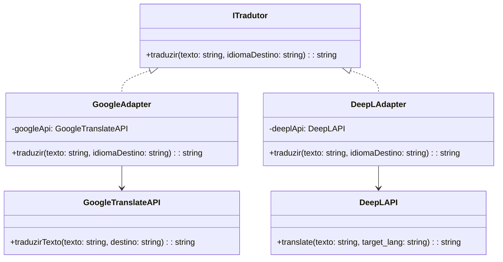

# Padrão de Projeto: Adapter (GoF Estrutural)

## Introdução
O padrão Adapter, pertencente ao grupo de padrões estruturais da Gang of Four (GoF), tem como principal função permitir que classes com interfaces incompatíveis possam trabalhar juntas. Ele atua como um tradutor entre diferentes componentes do sistema, convertendo chamadas de uma interface para outra esperada pelo cliente.  

No contexto do CorreioDigital, esse padrão é aplicado para integrar o sistema com APIs externas de tradução automática, garantindo que o módulo de chat consiga traduzir mensagens de forma transparente, independentemente da API utilizada (ex.: Google Translate, DeepL, etc.).

---

## Objetivo/Metodologia
O objetivo do uso do padrão Adapter é desacoplar a lógica interna do CorreioDigital das APIs externas utilizadas para tradução de texto e notificações.  
A metodologia aplicada seguiu o modelo proposto pela Gang of Four (GoF), com análise do problema de incompatibilidade de interfaces, definição dos participantes (Target, Adapter, Adaptee e Client) e representação UML.  

A elaboração do artefato envolveu:
1. Identificação dos pontos de integração com dependências externas (APIs de tradução, notificações e autenticação).
2. Mapeamento das interfaces incompatíveis.
3. Definição de uma interface padrão (`ITradutor`).
4. Implementação de adaptadores para diferentes serviços externos.
5. Representação do fluxo de comunicação no diagrama UML.

---

## Desenvolvimento (Adapter)
O Adapter permite que o módulo de chat do CorreioDigital realize traduções automáticas sem depender diretamente da API de terceiros. Assim, se for necessário trocar a API, basta alterar o adaptador, sem modificar o restante do código.

### 1. Estrutura UML
**Participantes:**
- **Client:** Módulo de Chat.
- **Target:** Interface esperada (`ITradutor`).
- **Adapter:** Classe intermediária que traduz as chamadas (`GoogleAdapter`, `DeepLAdapter`).
- **Adaptee:** API externa (`GoogleTranslateAPI`, `DeepLAPI`).



### 2. Exemplo de Código (Python)

#### Target
```Python
class ITradutor:
    def traduzir(self, texto, idioma_destino):
        pass
```

#### Adaptee 1
```Python
class GoogleTranslateAPI:
    def traduzir_texto(self, texto, destino):
        print(f"Traduzindo '{texto}' para {destino} com Google Translate")
```

#### Adapter 1
```Python
class GoogleAdapter(ITradutor):
    def __init__(self, google_api):
        self.google_api = google_api

    def traduzir(self, texto, idioma_destino):
        self.google_api.traduzir_texto(texto, destino=idioma_destino)
```

#### Adaptee 2
```Python
class DeepLAPI:
    def translate(self, texto, target_lang):
        print(f"Traduzindo '{texto}' para {target_lang} com DeepL")
```

#### Adapter 2
```Python
class DeepLAdapter(ITradutor):
    def __init__(self, deepl_api):
        self.deepl_api = deepl_api

    def traduzir(self, texto, idioma_destino):
        self.deepl_api.translate(texto, target_lang=idioma_destino)
```

### 3. Aplicação no CorreioDigital

- O módulo de chat chama tradutor.traduzir(texto, idioma) sem saber qual API está sendo usada.

- O Adapter cuida de adaptar o método correto da API externa.

- Caso o projeto troque de provedor de tradução, o sistema permanece estável e sem necessidade de alterar o código interno.

### 4. Vantagens e Desvantagens

#### 4.1 Vantagens

1. Desacoplamento entre sistema interno e dependências externas.

2. Facilidade para substituir ou adicionar novas APIs.

3. Reuso de código e manutenção simplificada.

#### 4.2 Desvantagens

1. Adiciona uma camada de complexidade.

2. Pode mascarar diferenças significativas entre APIs (ex.: limites, latência, qualidade da tradução).

## Bibliografia 

Gamma, E., Helm, R., Johnson, R., & Vlissides, J. Design Patterns: Elements of Reusable Object-Oriented Software. Addison-Wesley, 1994.

## Referências 

Refactoring Guru. Adapter Design Pattern. Disponível em: https://refactoring.guru/design-patterns/adapter.

## Histórico de Versões

| Versão | Data       | Descrição  | Autor(es) | Revisor(es) | Detalhes  da revisão |
|--------|-----------|-----------------------------|-----------|-------------|----------|
| `1.0`  | 13/10/2025 | Criação inicial do documento Adapter, adicionando introdução, metodologia, desenvolvimento (Estrutura UML, Exemplo de Código, Aplicação no CorreioDigital, Vantagens e Desvantagens), Bibliografia, Referências, e  Histórico de Versões |[Mariiana Siqueira](https://github.com/Maryyscreuza) | - | - |