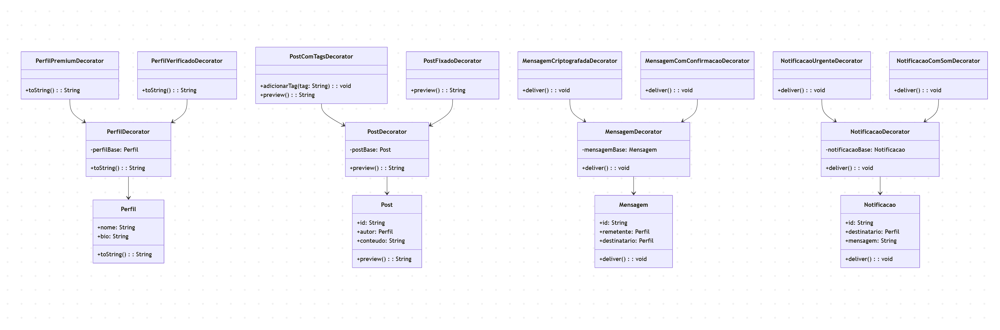

# Padrão Decorator no Projeto

## Introdução  

O **Decorator** é um padrão de projeto **estrutural** que tem como objetivo
acrescentar funcionalidades adicionais a um objeto de forma **flexível e
dinâmica**, sem a necessidade de modificar a sua estrutura original.  
Em vez de criar várias subclasses para cada variação de comportamento, o
Decorator permite **combinar responsabilidades** por meio de objetos que
“decoram” a classe base, empilhando funcionalidades conforme a necessidade.

A ideia central é envolver um objeto dentro de outro que implementa a mesma
interface, adicionando comportamento antes ou depois da execução dos métodos
originais. Assim, o objeto decorado mantém sua identidade, mas ganha **novas
capacidades em tempo de execução**.  

Esse padrão é bastante útil em cenários onde o sistema deve permanecer **aberto
para extensão, mas fechado para modificação** (Princípio Aberto/Fechado da
programação orientada a objetos). Ele promove **reuso de código**, evita a
explosão de subclasses e aumenta a **manutenibilidade** da aplicação.

No contexto deste projeto, o Decorator foi aplicado para estender dinamicamente
entidades do domínio, como perfis de usuários (premium, verificado), postagens
(com tags, fixadas), mensagens (com criptografia, confirmação de leitura) e
notificações (urgentes, com som). Essa abordagem garante um sistema mais
modular, escalável e fácil de evoluir.

## Objetivo/Metodologia

O principal objetivo da aplicação do **padrão de projeto Decorator** neste
projeto é fornecer um mecanismo de **extensão flexível** para as classes do
domínio, permitindo adicionar comportamentos ou responsabilidades de forma
dinâmica, sem a necessidade de modificar as implementações originais. Essa
abordagem garante maior modularidade, evita a duplicação de código e mantém
a base do sistema mais clara e fácil de evoluir ao longo do tempo.  

A utilização do Decorator foi orientada por dois fatores principais:  
1. A necessidade de **personalizar funcionalidades** de acordo com cenários
distintos, como usuários comuns que podem se tornar premium ou verificados;  
2. A possibilidade de **empilhar comportamentos** para enriquecer objetos já
existentes, como posts que podem ser fixados, receber tags ou passar por
processos de moderação mais rigorosos.  

A metodologia seguida envolveu a identificação de classes com **potencial de
evolução contínua**, como `Perfil`, `Post`, `Mensagem` e `Notificacao`. Em
vez de criar múltiplas subclasses para cada variação, foram definidos
**decoradores especializados**, cada um responsável por acrescentar uma
função extra, como destaque visual, criptografia, alerta sonoro ou marcação
de status.  

Com isso, é possível **combinar dinamicamente** diferentes decoradores,
adaptando o comportamento do sistema às necessidades do usuário ou às regras
de negócio. Essa abordagem reforça princípios importantes de engenharia de
software, como **baixo acoplamento, alto reuso de código e aderência ao
Princípio Aberto/Fechado (OCP)**.  

No contexto do projeto, o Decorator viabilizou a evolução incremental do
sistema, permitindo que novas funcionalidades sejam incorporadas de forma
não-invasiva, mantendo a arquitetura coesa e a manutenção simplificada.

## Implementação

**Figura 1:** Diagrama UML Decorator  

## Vantagens

## Desvantagens

## Bibliografia

> GAMMA, E.; HELM, R.; JOHNSON, R.; VLISSIDES, J.  
> **Padrões de Projeto: Soluções Reutilizáveis de Software Orientado a Objetos**.  
> Bookman, Porto Alegre, 2000. (Clássico catálogo GoF onde o padrão Decorator foi descrito).

> Refactoring.Guru.  
> **Decorator**. Disponível em: <https://refactoring.guru/pt-br/design-patterns/decorator>.  
> Acesso em: 13 out. 2025.

> ALUR, D. et al.  
> **Core J2EE Patterns: Best Practices and Design Strategies**.  
> Prentice Hall, 2003. (Referência sobre uso de Decorator em arquiteturas Java corporativas).

## Histórico de Versões

| Versão |     Data    | Descrição   | Autor(es) | Revisor(es) | Detalhes da revisão | 
| ------ | ----------- | ----------- | --------- | ----------- | --------------------|
| `1.0`  | 11/10/2025  | Criação do esqueleto do documento | [Túlio Augusto Celeri](https://github.com/TulioCeleri) e [Pedro Ferreira Gondim](https://github.com/G0ndim) |-|-|
| `1.1`  | 13/10/2025  | Criação da introdução e metodologia | [Túlio Augusto Celeri](https://github.com/TulioCeleri) e [Pedro Ferreira Gondim](https://github.com/G0ndim) |-|-|
| `1.2`  | 13/10/2025  | Criação do Diagrama UML Decorator e atualização da introdução e metodologia | [Túlio Augusto Celeri](https://github.com/TulioCeleri) e [Pedro Ferreira Gondim](https://github.com/G0ndim) |-|-|

